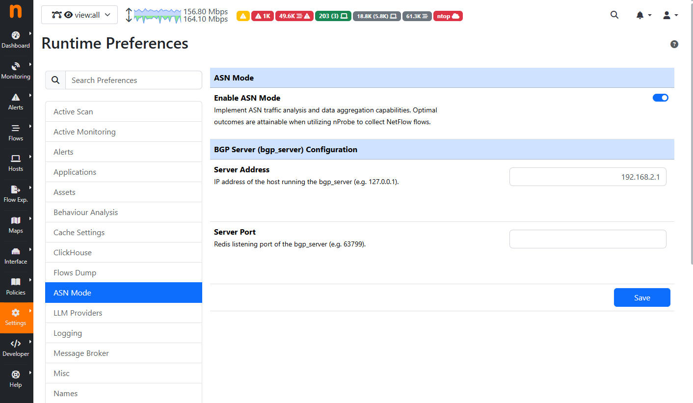
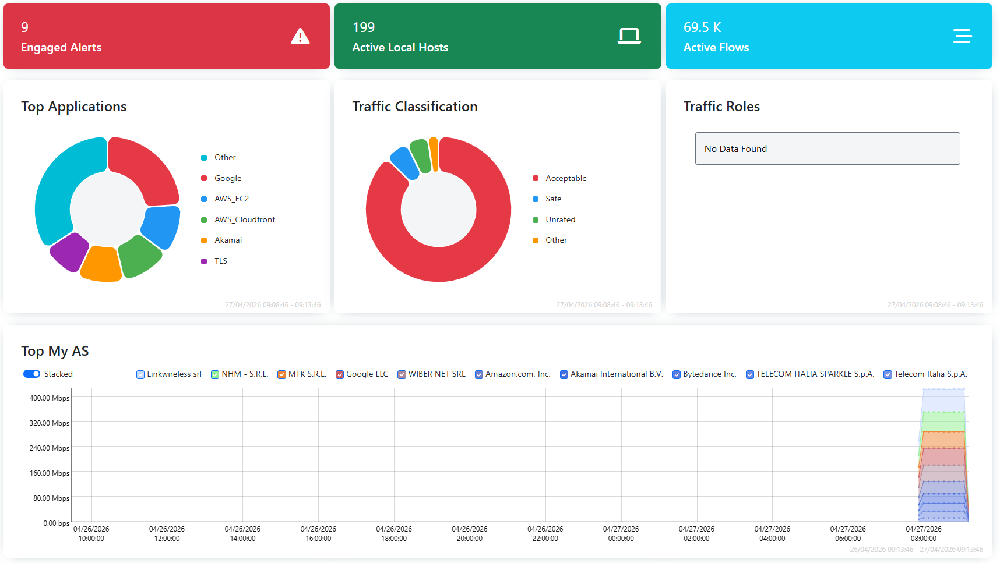
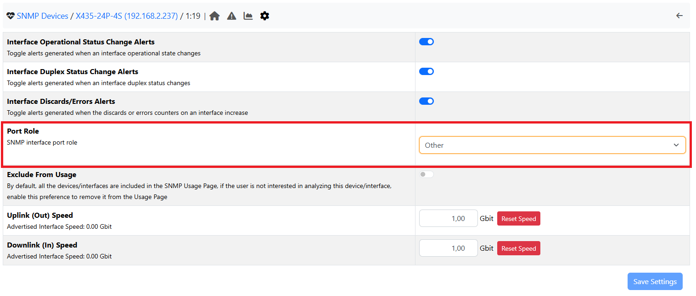
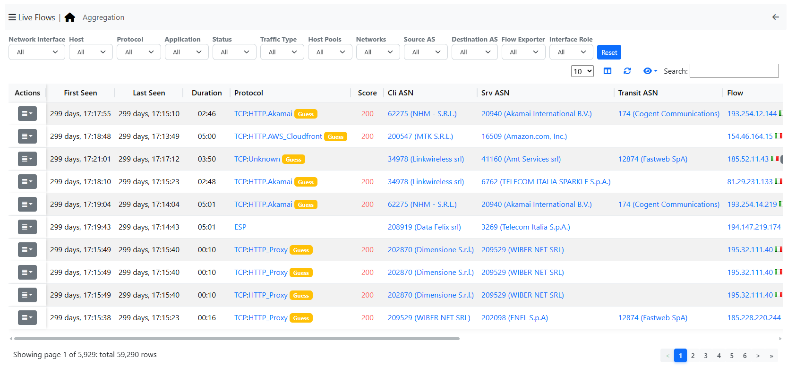
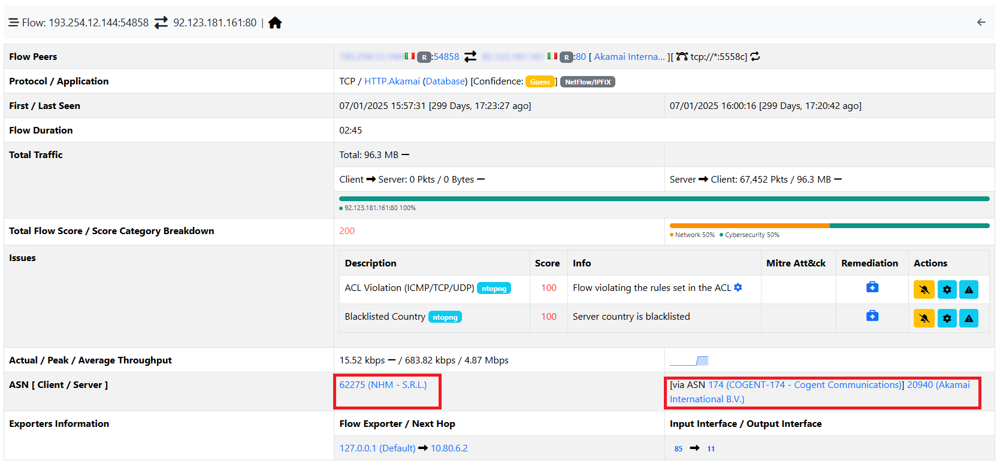

AS Mode
=======

ntopng allows users to monitor network traffic, providing visibility on Autonomous Systems instead of IPs.
By enabling this mode, the Dashboard will switch to a view where the AS is at the center (for example, there will be no more Top IP Src/Dst but Top ASN).
Flows will also be centered around the AS instead of IPs, while still keeping that information displayed in case it is needed.
To enable this mode, go to Settings, then to Preferences, where a section called AS Mode will be available. From there it will be possible to enable AS Mode, focusing on AS information.

.. note::

    The `Flows <https://www.ntop.org/guides/ntopng/user_interface/network_interface/flows/flows.html>`_ (Live and Historical, if available) and `Hosts <https://www.ntop.org/guides/ntopng/basic_concepts/hosts.html>`_ information will be moved to the Views menu entry.

Dashboard
---------

The ntopng Dashboard will now display information related to Autonomous Systems, like Top AS, and Autonomous Systems information the user regards as important, like Top Peering Interfaces.

Exporters
---------

It will also be possible to understand from which Exporter each AS is seen and with the relative amount of traffic.

Exporter Interfaces
-------------------

It is also possible to mark the interfaces of each exporter with a "Role":

- Customer
- IX (Internet Exchange)
- Internet LAN
- Internet Connectivity (Uplink)
- Peering
- Transit
- Other

To set those Roles, the user needs to go to the SNMP settings of the interface and select the Role to assign.

By setting this role on the interfaces, it will be possible to filter (for example in the Flows page) by each role, and it will also fill the empty `Timeseries <https://www.ntop.org/guides/ntopng/basic_concepts/timeseries.html>`_ in the Dashboard.

Flows
-----

Since information is now centered around Autonomous Systems, it will be possible to view not only the Source and Destination Autonomous Systems, but also the Transit AS.

.. note::

    Flows information are moved to the Views menu entry in AS Mode.

By opening the Details of a flow, it will also be possible to see the AS Transit for each Source and Destination.

