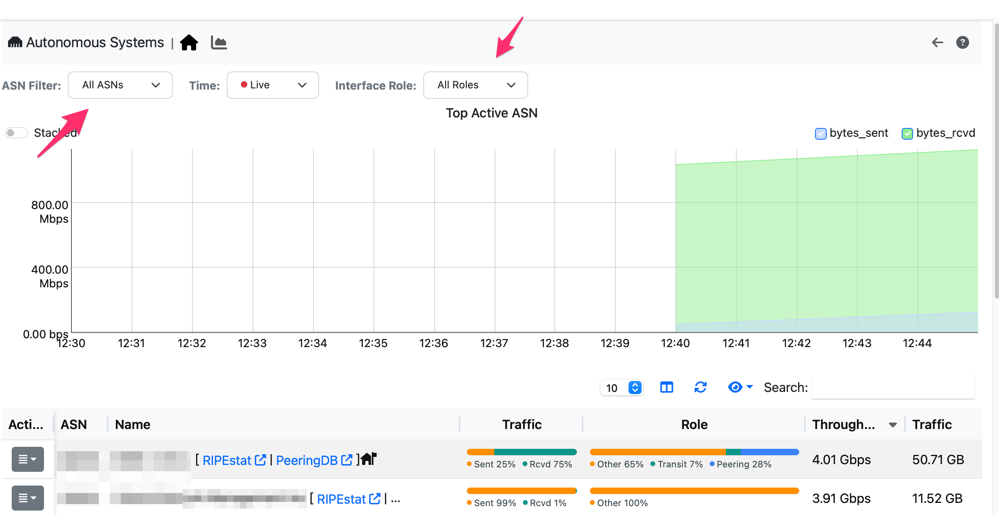

Using AS Mode
#############

In AS mode your GUI will be AS-centric, meaning that you will be focusing on AS, routers and network interfaces rather than on IP addresses.

  AS List

In the Authonomous Systems page under the Interface Menu, it is possible to list live/hostorical AS traffic statistics. For each AS the traffic is represented based on its role (e.g. peering vs transit) and distribution (e.g. received vs sent). Clicking on an AS it is possible to see the traffic breakdown divided per router interface (i.e. how the traffic is sent/received for this AS) and AS (i.e. what AS are sending/receiving traffic from the selected AS.

The BGP routing information provided by the bgp_server (see the nProbe user's guide https://www.ntop.org/guides/nprobe/) is reported in several ways:

- For collected flows, BGP information is reported by nProbe to ntopng via ZMQ.

  
  .. figure:: ../img/bgp_info.png

- You can query the RIB (Routing Information base) living inside the bgp_server and see arbitrary routes, including RPKI validation. This can be accessed from the left sidebar Views -> Routing Information base and query the RIB. The best route (according to the BGP protocol) is reported with a badge, and the route is validated via RPKI.

  .. figure:: ../img/looking_glass.png
  
- BGP alerts for monitored prefixes can be visualized inside the alert page of the system interface under the AS tab.

