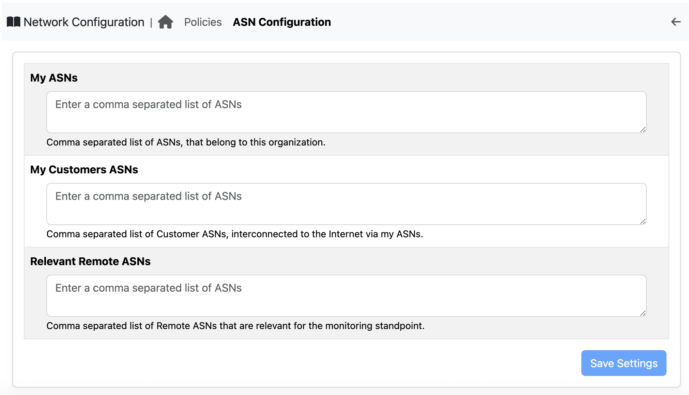
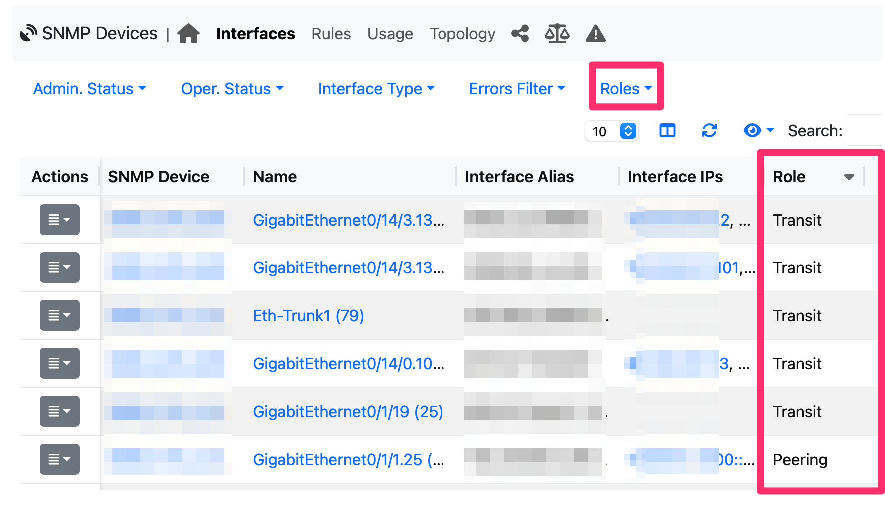
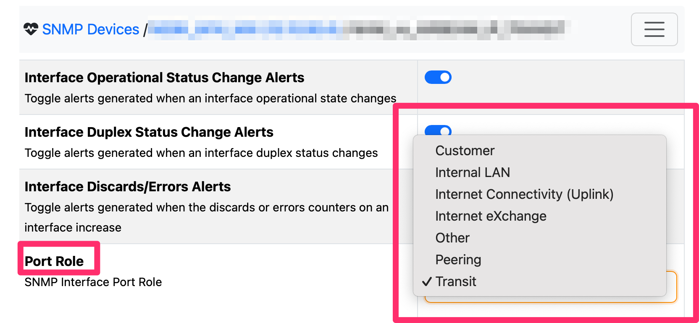
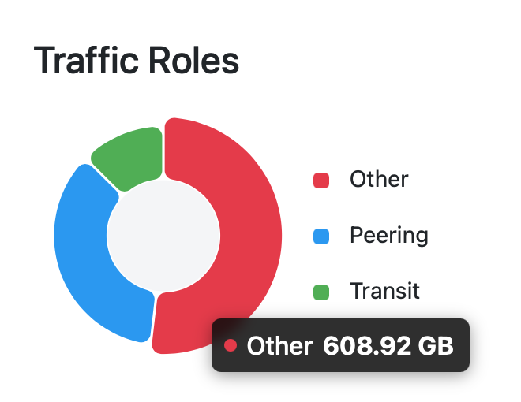
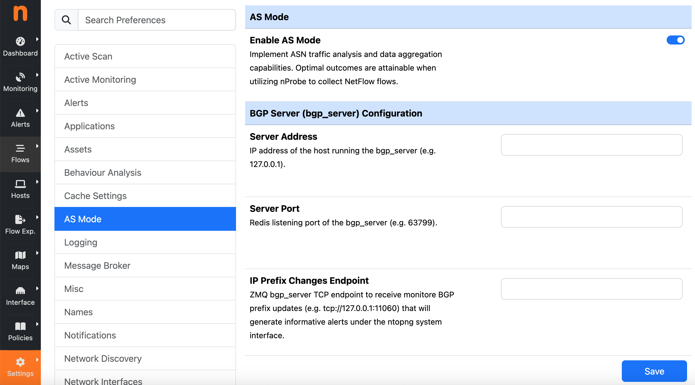

Configuration
#############

The first step is to configure the list of ASN (Authonomous System Number). In order to do this goto the left sidebar and select Policies, then "Network Configuration" and inside the page select "ASN Configuration".

ASN Configuration
-----------------

  ASN Configuration

In this page you need to configure the list of ASN that are relevant for your job. The format is a liust of numebrs separated by comma (CVS). In particular you need to specify:

- Your ASNs. If you are a large company you have registered an AS number. Sometimes companies have more than one ASN, and all of them need to be specified here. This allows ntopng to understand what are the "home" ASN.
- Your customer ASNs. Specify here the ASN list of customers that access the Internet through your network. In essence these are customers that use your company to access the Internet. THis list is important as it will allow ntopng to underatdn what portion of the traffic is generated by your company, and what portion is instead made by your customers.
- Relevant ASNs. In this list you specify ASNs that you do not control (e.g. CDN or large companies that provide popular network services) but that are relevant for your business. These ASN need to be monitored because if they are affected by connectivity problems, you and your customers might also have a negative impact.

SNMP Interface Configuration
----------------------------

  SNMP Interface Roles

Through SNMP, ntopng polls interface information and traffic statistics. In addition to this information, users can specify the role of the interface on the network. This needs to be specified manually as this information is not available in SNMP MIBs.

  SNMP Interface Role Configuration

The interface tole can be set clicking on the (cog) configuration icon that allows you to specify the role. Most relevant roles are peering, transit and Internet Exchange. You can also batch rename SNMP interfaces from withing ntopng by setting the inteface role based on the interfce alias description. For instance if the interface contains the word peering, its role will be set to peering.

Setting the interface role it's important as base on it, it will be able to calculate the traffic role breakdown available for instance in the reports page.

  Role Traffic Breakdown

Enable AS Mode
--------------

.. note::
   This preference is visible only if ntopng collects flows from ZMQ interfaces.

If you desire to view traffic focusing mostly on AS-to-AS rather than IP-to-IP traffic representation, then you should enable the ASN mode. You can do that going to the left sidebar and selecting Settings and then Preferences.

  AS Mode Configuration

The idea of AS mode is to focus user attention on ASs. Enabling it you can see a new report that has been designed exactly for this use case, as well slightly modify the ntopng GUI focusting on ASs rather than on IPs.

If you have an ASN you need to manager routing advetisements in order to let the world reach your network. This is usually achieved using the BGP (Border Gateway Protocol) protocol. nProbe includes a new service designed to handle BGP and BMP (BGP Monitoring Protocol) advertisements: please refer to the nProbe manual for more information about it. The daemon implementing BGP/BMP protocol is named `bgp_server`. In the ntopng configuration you need to specify the IP address where the bgp_server is active, and the port where the server delivers routing information through a redis-compatible protocol (-r parameter in bgp_server).

Optionally, if you have configured the bgp_server to monitor some BGP prefixes (-n parameter in bgp_server), you need to specify the ZMQ URL to which the bgp_server will advertise routing prefix changes.

