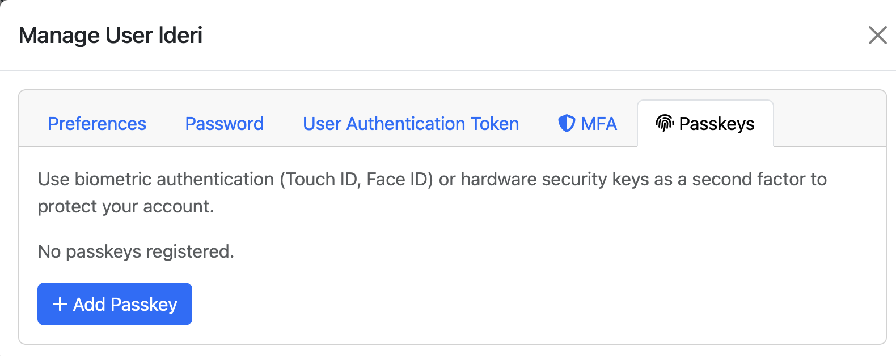
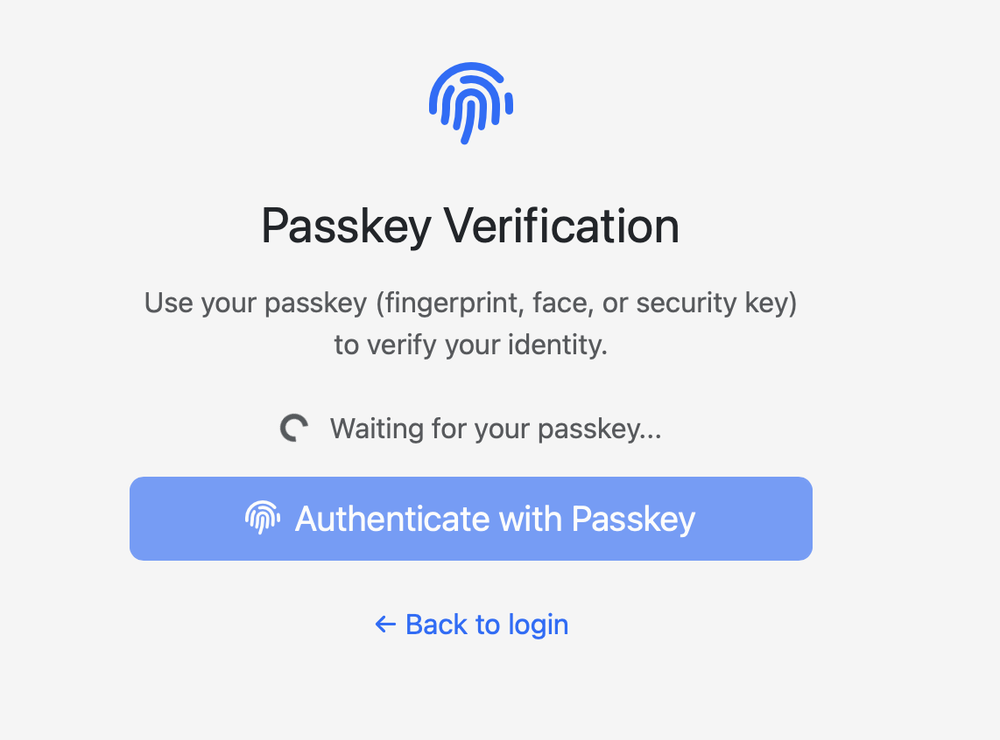

.. _UserAuthentication:

User Authentication
===================

Only authenticated users can access the ntopng web GUI. After a
successful authentication, ntopng creates an authenticated session and
send it to the web user inside an HTTP cookie. From that point on, the
web user will be able to transmit the received session back to ntopng
inside another HTTP cookie along with every request made.

The session duration is configurable as shown in the following picture
and can go from 1 minute up to 7 days. The shorter the session
duration, the more secure the ntopng accesses are. Indeed, a
compromised session could be used by an attacker for the whole
duration time. It is up to the administrator to choose a duration that
can guarantee enough security, depending on the environment of the
operations. The administrator can also decide to terminate all
the active sessions at midnight, simply by toggling the preference
shown in the figure. This will force all the web users to
re-authenticate again, regardless of their residual session duration.

.. figure:: img/advanced_features_authentication_duration.png
  :align: center
  :alt: ntopng Authentication Duration

  ntopng Authentication Duration

ntopng supports multiple methods to authenticate users into the ntopng GUI. Individual methods
can be enabled from the ntopng "User Authentication" preferences.

.. figure:: img/advanced_features_authentication_methods.png
  :align: center
  :alt: ntopng Authentication Methods

  ntopng Authentication Methods

It is possible to enabled more than one method at once. In this case, when a user
tries to authenticate, the enabled authentication methods will be tried in the same
top-down order as they are listed in the preferences. If at least one of the authentication
methods succeeds, then the user is allowed to access the web GUI.

Local Authentication
--------------------

This is the authentication method enabled by default when ntopng is installed.
It will use the users credentials configured_ via the ntopng GUI to authenticate new users.

.. _`configured`: user_interface/shared/settings/users.html

Multi-Factor Authentication
---------------------------

Multi-Factor Authentication (MFA) is a security system that requires users to provide two or more verification factors to gain access to a resource such as an application, online account, or VPN. You can enable MFA on an existing user by clicking on the MFA tab.

.. figure:: img/enable_mfa.png
  :align: center
  :alt: Enable MFA

  Enable User MFA

You have to scan the QR code using a Time-based One-Time Password (TOTP) authenticator app such as Google Authenticator, Authy, or similar. Done that you need to enter the OPT (One Time Password) generated by the app in the auhtnetication field and click on the Enable button.

.. figure:: img/mfa_enabled.png
  :align: center
  :alt: MFA Enabled

  User with MFA Enabled

Whenver you login to ntopng using username and passowrd with a user with MFA enabled, ntopng shows you a page where you need to specify the OTP

.. figure:: img/mfa_check.png
  :align: center
  :alt: MFA Check

  Login of a User with MFA Enabled

If you fail to enter the MFA code, login will not be completed.

.. note::
  MFA and Passkey cannot be enable at the same time. So if you enable MFA, you cannot enable Passkey and vice-versa.

.. _oidc-passkey:

Passkey
-------

Passkey authentication is a passwordless sign-in method that allows you to log in to websites and apps using the same way you unlock your device—such as a fingerprint, face scan, or a screen lock PIN. It is designed to replace traditional passwords entirely, offering a significantly more secure and faster experience. In ntopng, it can be enabled to implement a multi-factor authentication method.

Passkey will only work if selected conditions are met:

- It works only over a secure TLS 1.2+ connection (except for localhost during development). This means that you must enable HTTPS on ntopng (-W <https port>).
  For passkey authentication to work, your HTTP server must use HTTPS with a valid, trusted TLS certificate and modern hash algorithms. The signature algorithm must use the SHA-2 family (e.g., SHA-256). SHA-1 is no longer considered secure and is rejected by modern platforms. A simple way to create a valid certificate suitable for passkey is to use Let’s Encrypt, which can be used as described in this post https://www.ntop.org/securing-ntopng-with-ssl-and-lets-encrypt/.
- For passkey authentication to work, your HTTP server must use HTTPS with a valid, trusted TLS certificate and modern hash algorithms. The signature algorithm must use the SHA-2 family (e.g., SHA-256). SHA-1 is no longer considered secure and is rejected by modern platforms. A simple way to create a valid certificate suitable with passkey is to use Let's Encrypt that can be uses as described in this post https://www.ntop.org/securing-ntopng-with-ssl-and-lets-encrypt/.

Similar to MFA, you can enable Passkey in the user's configuration page. As Passkey is a kind of MFA, either you enable MFA or Passkey (not both at the same time).

After you click on the “Add Passkey” button, ntopng asks you how you want to name the passkey for ntopng: you can pick any name. Then it shows you a dialog for configuring it.

.. figure:: img/set_passkey.png
  :align: center
  :alt: Set Passkey Configuration

Done that, it’s all set. Now whenever you log in to ntopng for the use for which you enabled Passkey, after the authentication step, a new dialog is displayed.

where you can authenticate. Most passkeys are synced across your devices through services like the Google Password Manager, Apple iCloud Keychain, or Microsoft Windows Hello. This ensures that if you set up a passkey on your phone, it is automatically available on your laptop or tablet. Alternatively, they can be stored on physical hardware like a YubiKey for the highest level of security. This means that once you have configured a user passkey on a system (e.g. on a macOS device), only the macOS user of such a device can successfully authenticate with Passkey.

As with MFA, if you want to disable Passkey, you ca do it from the user configuration page in ntopng.

.. _oidc-authentication:

OpenID Connect (OIDC) / SSO Authentication
-------------------------------------------

ntopng supports Single Sign-On via the **OpenID Connect** protocol
(Authorization Code Flow). This allows users to log in with an external
Identity Provider (IdP) such as Keycloak, Okta, Auth0, Azure AD / Entra ID,
or Google, without typing a password into ntopng.

When OIDC is enabled, the ntopng login page shows a **"Login with SSO"**
button. Clicking it redirects the browser to the IdP, which handles
authentication (including any MFA the IdP enforces). After a successful
login at the IdP, the browser is redirected back to ntopng, which validates
the identity token and creates a session.

.. note::

  OIDC authentication requires ntopng to be reachable at a stable
  URL (``base_redirect_uri``) so the IdP can redirect back to it.

Configuration
~~~~~~~~~~~~~

OIDC settings are available in **Settings → Preferences → User Authentication**.
The following parameters must be configured:

- **Enable OIDC Authentication** — toggle to activate SSO login.

- **Issuer URL** — the base URL of the IdP realm or tenant. ntopng will
  append ``/.well-known/openid-configuration`` to auto-discover all required
  endpoints. Examples:

  - Keycloak: ``https://keycloak.example.com/realms/myrealm``
  - Azure AD: ``https://login.microsoftonline.com/<tenant-id>/v2.0``
  - Google: ``https://accounts.google.com``

- **Client ID** — the OAuth2 client ID registered at the IdP for ntopng.

- **Client Secret** — the OAuth2 client secret for the registered client.

- **Base Redirect URI** — ntopng base URL (e.g.
  ``https://ntopng.example.com``). The IdP will redirect to
  ``{base_redirect_uri}/oidc_callback`` after authentication; this exact URI
  must be whitelisted in the IdP client configuration.

- **Scopes** — space-separated OIDC scopes to request. The default value
  ``openid profile email roles`` is suitable for most IdPs; adjust only if
  your IdP requires different scopes.

- **Group Claim** — name of the JWT claim that carries group membership
  (default: ``groups``). Used to determine whether a user is an admin.

- **Admin Group** — value in the group claim that grants the ntopng
  administrator role. Users whose group claim contains this value will be
  logged in as administrators. Leave empty to treat all OIDC users as
  unprivileged.

- **Auto-create users** — when enabled, ntopng automatically creates a local
  user account on the first successful OIDC login. When disabled (default),
  the ntopng account must be pre-created manually; users without a matching
  account are denied access even if they authenticate successfully at the IdP.

User Mapping
~~~~~~~~~~~~

ntopng derives the local username from the JWT claims returned by the IdP,
in the following priority order:

1. ``preferred_username`` claim
2. ``email`` claim
3. ``sub`` (subject) claim

The derived value is sanitized: lowercased, with only ``[a-z0-9._-]``
characters kept (``@`` is converted to ``_``).

The administrator role is determined by checking whether the configured
**Group Claim** in the token contains the value set in **Admin Group**
(both string-valued and array-valued claims are supported).

For a detailed technical description of the OIDC implementation, see
``doc/developers/README.OIDC.md``.

LDAP Authentication
-------------------

An LDAP server can be used to authenticate users.

.. figure:: img/advanced_features_ldap_settings.png
  :align: center
  :alt: LDAP Authentication Settings
  :scale: 80

  LDAP Authentication Settings

Here is an overview of the different parameters:

  - LDAP Accounts Type: can be used to choose for the POSIX based accounts or the
    sAMAccount accounts.

  - LDAP Server Address: the address of the LDAP server. Ports 389 and 636 are the
    default ports for ldap and ldaps, respectively.

  - LDAP Anonymous Binding: based on the LDAP server configuration, performing
    an LDAP binding request (needed to communicate with the LDAP server) may or
    may not require authentication. If anonymous binding is disabled, then explicit
    credentials must be supplied.

  - LDAP Search Path: this indicates the root path where users and groups information
    are located and is used by ntopng during the login.

  - LDAP User Group: the value for the "memberOf" user attribute used to identify
    normal users (without privileges). See the readme at the end of this section
    for more information.

  - LDAP Admin Group: the value for the "memberOf" user attribute used to identify
    admin users (with privileges). See the readme at the end of this section
    for more information.

On a Linux client, it is possible to test the connection to the LDAP server with the following commands.

If anonymous binding is enabled:

.. code:: bash

  ldapsearch -H <ldap_server_ip> -x -b 'dc=mydomain,dc=org' -s sub "(objectclass=*)"

otherwise:

.. code:: bash

  ldapsearch -H <ldap_server_ip> -D 'cn=binding_user,dc=mydomain,dc=org' -w binding_password -b 'dc=mydomain,dc=org' -s sub "(objectclass=*)"

The parameters above should be modified according to the actual configuration in use.
It is important to configure the LDAP server properly in order to correctly expose the necessary
group metadata to ntopng, otherwise authentication will not work properly. Read the
next paragraph for recommendations to be applied to an OpenLDAP server for ntopng communication.

A detailed blog post that discusses LDAP authentication and shows how
to configure an LDAP server can be found at:
https://www.ntop.org/ntopng/remote-ntopng-authentication-with-radius-and-ldap/

A step-by-step guide showing the configuration of *slapd* on Ubuntu to setup a sample LDAP server
to be used for authenticating ntopng users (posix) is also available at:
https://github.com/ntop/ntopng/blob/dev/doc/README.ldap.md

Common Issues
~~~~~~~~~~~~~

In case the LDAP authentication is not working as expected despite the configuration,
it is possible to enable debug logging by toggling the LDAP Debug preference. This
should add to the ntopng service logs useful information when a login is attempted.

One common error logged by ntopng is:

.. code:: bash

   LDAP bind error: Can't contact LDAP server

This may be related to TLS certificate verification when using LDAPS (ldaps://),
and you may need to create or modify /etc/ldap/ldap.conf to fix this.
This configuration file lets you define trusted certificate authorities and other
TLS/SSL settings for OpenLDAP clients.
Typical entries you might add to /etc/ldap/ldap.conf:

.. code:: bash

   TLS_CACERT /etc/ssl/certs/my_ldap_ca.pem
   TLS_REQCERT demand

Where TLS_CACERT is the path to the CA certificate file that signed your LDAP server's cert.
This means you need to obtain the CA certificate that signed your LDAP server's certificate
(or the server cert if it's self-signed) and place it somewhere like /etc/ssl/certs/my_ldap_ca.pem

OpenLDAP as Active Directory proxy
~~~~~~~~~~~~~~~~~~~~~~~~~~~~~~~~~~

When using the sAMAccount account type in combination with OpenLDAP as an Active Directory proxy,
ntopng authentication will not work because the "memberOf" attribute used by ntopng is not found.
In fact, OpenLDAP does not understand the "memberOf" attribute of AD and so it creates a
MEMBEROF (uppercase) pseudo attribute, which is not standard.

In order to make this setup work properly, the following should be added to the OpenLDAP config:

.. code:: text

   attributetype ( 1.2.840.113556.1.2.102
     NAME 'memberOf'
     SYNTAX '1.3.6.1.4.1.1466.115.121.1.12'
   )

When using POSIX accounts, the LDAP server should be configured as follows in order
to work correctly with ntopng:

- Into the LDAP user configuration, note down the "uid" parameter (called "User Name"
  in OpenLDAP, not to be confused with "UidNumber"). You will need it below.

- Into the LDAP group configuration, you should add a new custom field "memberUid", with
  the same value of the user "uid" field above.

As an example, supposing there is a group "usersGroup" and a user "ntopngUser" as uid,
a new field "memberUid" should be added to the "usersGroup" configuration with "ntopngUser" as
value.

The *memberUid* (ntopngUser in this case) is the username to use for the ntopng authentication.

RADIUS Authentication
---------------------

.. figure:: img/advanced_features_radius_settings.png
  :align: center
  :alt: RADIUS Authentication Settings
  :scale: 80

  RADIUS Authentication Settings

These are the required options to setup the connection with a RADIUS authenticator:

- RADIUS Server Address: the address (IP/hostname) and port of a radius server.
  The default RADIUS port is 1812.

- RADIUS Secret: the secret to authenticate with the server.

- RADIUS Admin Group: the name of the admin group to be returned by radius as
  the value of the `Filter-Id`_ attribute to be used to identify admin users. All
  the other users are considered unprivileged by default.

.. _`Filter-Id`: https://tools.ietf.org/html/rfc2865#section-5.11

On a Linux system, RADIUS authentication can be tested with the following command:

.. code:: bash

  radtest testuser Password123 127.0.0.1 0 testing123

where:

  - `testuser` is the username to authenticate
  - `Password123` is the user password
  - `127.0.0.1` is the RADIUS server address
  - `testing123` is the RADIUS secret

Upon a successfully authentication, the command above should return the following output:

.. code:: bash

  rad_recv: Access-Accept packet from host 127.0.0.1 port 1812, id=4, length=20

A detailed blog post that discusses RADIUS authentication in ntopng,
and shows how to set up a RADIUS server can be found at:
https://www.ntop.org/ntopng/remote-ntopng-authentication-with-radius-and-ldap/

Additional Notes
~~~~~~~~~~~~~~~~

ntopng sends an Access-Request to the RADIUS server and, if Access-Accept
is returned, the user is authenticated.

In order to distinguish between admin and normal users, a `Filter-Id` attribute is
used (https://tools.ietf.org/html/rfc2865#section-5.11). The `Filter-Id` for admin
users should correspond to the `RADIUS Admin Group` set into the ntopng RADIUS preferences.

Setting up a FreeRadius server
~~~~~~~~~~~~~~~~~~~~~~~~~~~~~~

Check out https://www.packet6.com/install-freeradius-ubuntu-server.
`testing123` is the default secret for localhost. In order to set up the Filter-Id
attribute for a user, the following lines should be added to `/etc/freeradius/users`

.. code:: text

   testuser Cleartext-Password := "Password123"
     Filter-Id = "ntopAdmin"

In order for authentication to work properly, testuser must actually exist as a Linux user
in the system where FreeRadius is installed.

HTTP Authentication
-------------------

Ntopng also supports authentication via HTTP POST requests. In this case,
and JSON data

.. figure:: img/advanced_features_http_authenticator.png
  :align: center
  :alt: HTTP Authentication Settings
  :scale: 80

  HTTP Authentication Settings

The only needed parameter is HTTP Server URL. Here is a description of the API:

  1. when a user tries to authenticate, ntopng will send a POST request to the above URL
     with JSON data with two fields: `user`, the username to authenticate, `password` its password

  2. the authenticator will respond with the HTTP code `200` if the authentication is successfully,
     otherwise another (unspecified) code is returned.

  3. in case `200` is returned, JSON data will be sent back to the ntopng server. If this
     data contains a `admin` = True pair, then the given user is authenticated as admin. Otherwise,
     it is authenticated as a normal unprivileged user.

On a Linux system, it's possible to test an HTTP authenticator implementation with the curl command:

.. code:: bash

  curl --header "Content-Type: application/json" --request POST --data '{"user":"test-user","password":"test-password"}' -v http://localhost:3001

This will try to authenticate a user called `test-user` with a password `test-password` on a local http authenticator
running on port 3001.

The following link provides some information on how to setup a simple HTTP authenticator to
work with ntopng: https://github.com/ntop/ntopng/blob/dev/doc/README.HTTP_AUTHENTICATOR .

Unable to Login
---------------

Instructions on how to recover after being locked out of the ntopng GUI can be found
in the `FAQ page`_.

.. _`FAQ page`: faq.html#cannot-login-into-the-gui

Token based authentication
--------------------------

A security token is a "trusted tool" to enter a restricted resource. It can be seen as a key that allows a user to authenticate and prove it's identity.
The logic behind the token - based authentication is simple.
Token based authentication is a protocol which allow users to enter their username and password to verify their identity and in return to obtain an access token.
At first,there is a request to the server that the user makes inserting login credentials.
Right after comes the verification – by checking inserted credentials, the system (server) determines if the user could obtain the permission to have the access to the resource.
In the end the server generates a secured, signed token for the user for unlimited duration.
Once the token has been issued, it can be used instead of usual login credentials, also,in case of necessity it can be offered to other users. Does not require providing others with personal passwords and can be considered a better security measure. Moreover, token authentication uses encrypted, machine- generated code to verify the user identity.

The token in ntopng can be generated following these steps:

1. Open the settings
2. Go to User
3. Click Edit
4. Choose User Authentication Token
5. Generate Token

.. figure:: img/advanced_features_authentication_token.png
  :align: center
  :alt: ntopng Authentication Token

.. _token: https://www.ntop.org/guides/ntopng/api/rest/api_v2.html

The token can be used to authenticate by setting `Token` as authorization method in the HTTP request, example:

.. code:: text

   Authorization: Token 39ca319a42...

You can also use this from curl as follows:

.. code:: text

   curl -v http://localhost:3000/lua/locale.lua -H 'Authorization: Token 39ca319a42...'

Please check the API documentation for further information about token_ usage.
