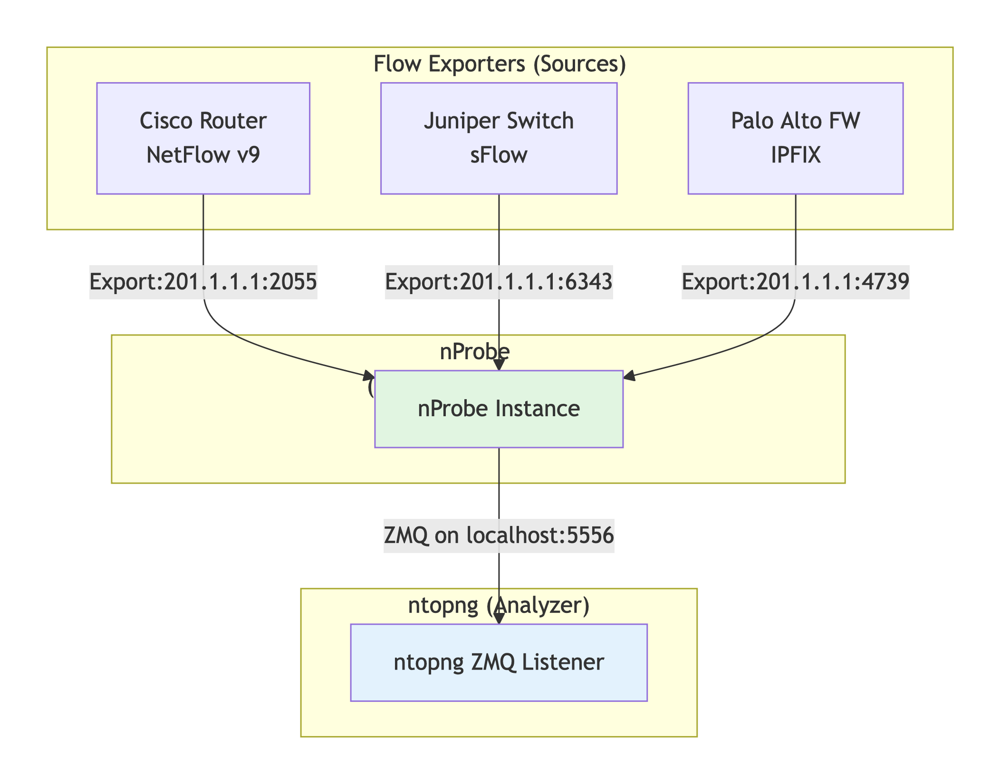
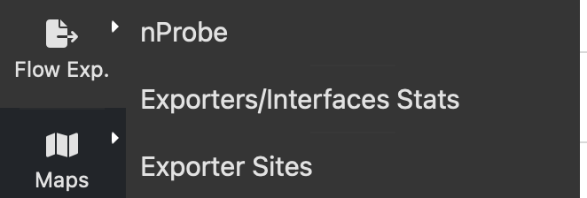
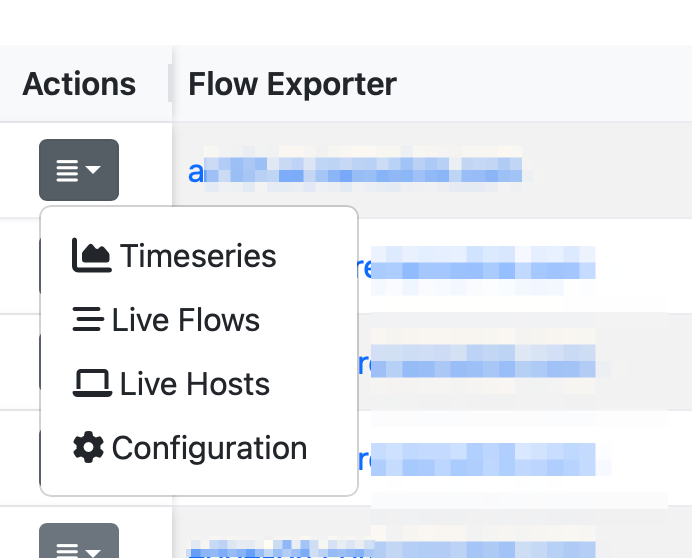

Flow Exporters
##############

A flow exporter is any network device or software that generates and sends flow data to a collector. It's essentially the source of flow information in network monitoring.

Key exporters caracteristics include:

- Flow Creation: Examines packets and groups them into flows based on 5-tuple (source IP, destination IP, source port, destination port, protocol)
- Statistics Aggregation: Counts bytes, packets, tracks TCP flags, timestamps
- Protocol Support: Exports in a specific flow format (NetFlow v5/v9, IPFIX, sFlow)
- Configurable Export: Destination IP/port, sampling rate, template refresh rates

In the above figure

- All exporters send to nProbe, not directly to ntopng
-	    nProbe becomes the single exporter from ntopng's perspective
-	    ntopng sees flows coming from nProbe's IP (e.g., 127.0.0.1)

	    
Management happens at nProbe level:

-    Configure exporters to send to nProbe's IP:port
-    nProbe handles protocol translation, load balancing
-    Exporters are "hidden" from ntopng

Exporters in ntopng
-------------------

Flow exporters are accessed from the menu on the left sidebar:

	    
Exporters are listed under the nProbe instance that collects flows from. You can read statistics abotu collected flows, drops and active license. On large networks you can define sites on which exporters are active so you can cluster them based on their location. Sites can be configured from the above menu and you set its location under the configuration menu entry.

Exporter sites are reports in various ntopng pages such as the live flow page or the dashboard. If you have enabled historical flows you can search for flows according to a site.
