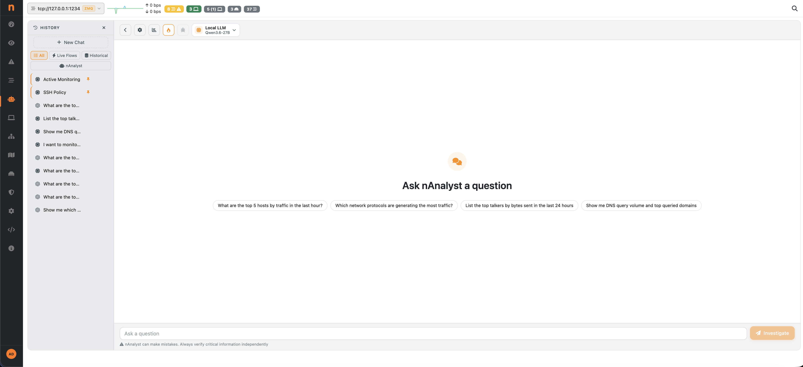
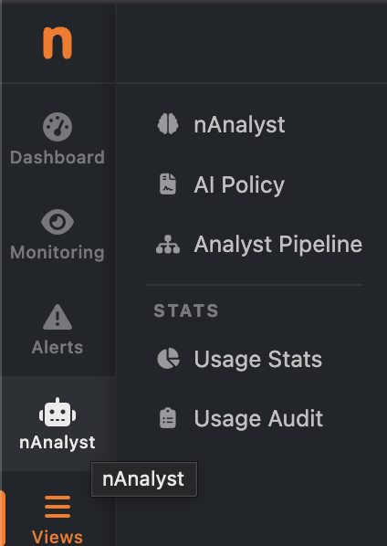
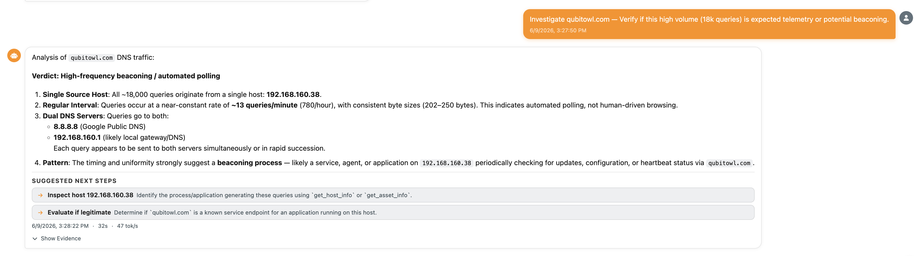
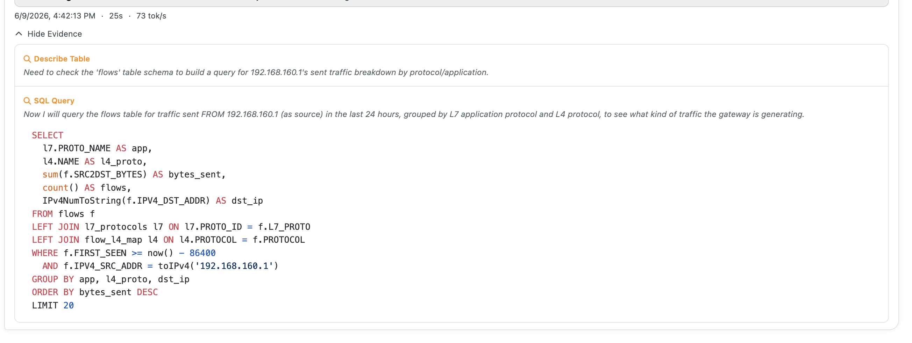
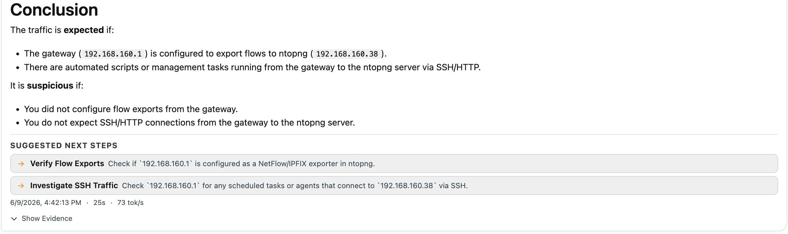
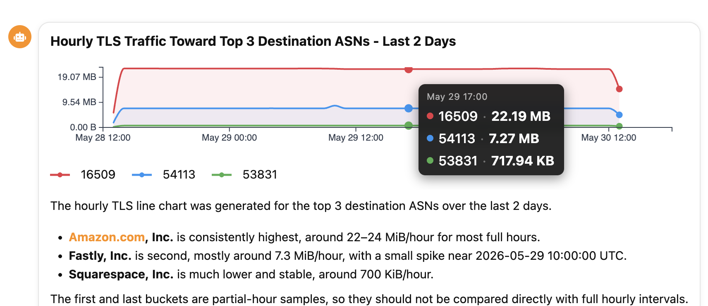
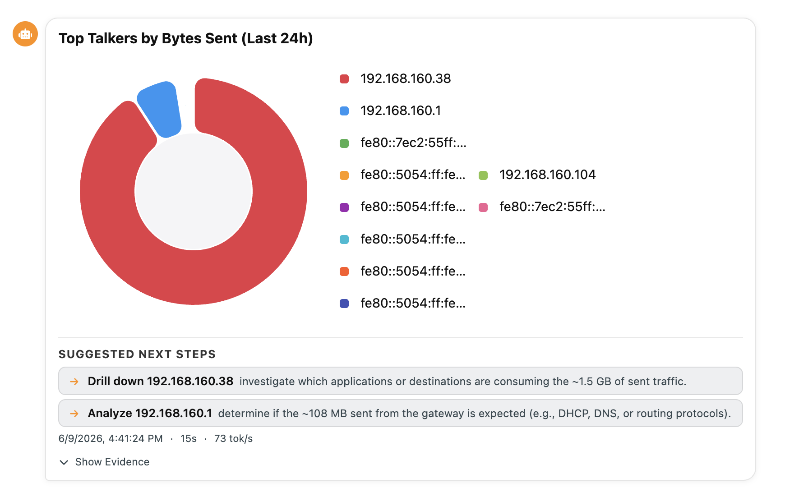

.. _nAnalystChat:

Chat Interface
==============

nAnalyst's primary interface is a conversational chat window embedded in the ntopng web UI. It allows analysts to query network data, trigger actions, and review evidence without writing SQL or navigating multiple dashboards.

   nAnalyst chat interface

Accessing the chat
------------------

The nAnalyst chat is available from the ntopng menu -> nAnalyst. Each conversation is tied to the authenticated user and persists across browser sessions so context from previous investigations is retained.

   nAnalyst Menu 
 
Asking questions
----------------

Questions can be asked in plain English. nAnalyst understands network terminology natively:

.. code-block:: text

   "Show me DNS query volume for each hour in the last day and the top queried domains"

   "Which hosts contacted the most external IPs in the last 6 hours?"

   "Is there any unusual outbound traffic from 192.168.1.50?"

   "What applications are consuming the most bandwidth on the LAN?"

The agent will:

- Select the relevant tools and data sources
- Execute the necessary SQL queries
- Return a structured answer with embedded charts and an evidence table
- Suggest actionable next steps

Reading the response
--------------------

Each nAnalyst response consists of three parts:

**Answer**
  A plain-language explanation of what was found, grounded in the evidence collected.

**Evidence log**
  A collapsed but expandable section showing every tool called, the SQL executed, and the raw results returned. This is the "no black box" guarantee — you can verify every claim.

**Suggested next steps**
  When relevant, nAnalyst proposes follow-up investigations or actions such as creating a policy, adding an active monitoring script, or silencing a known-good alert.

   nAnalyst Answer

   nAnalyst Evidence Log

   nAnalyst Suggested Next Steps

Inline charts
-------------

When a query returns time-series or ranked data, nAnalyst automatically generates and embeds a chart (line, bar, or table) directly in the chat response. Charts are interactive and export-ready.

   nAnalyst Line Chart

   nAnalyst Pie Chart

Multi-turn conversations
------------------------

nAnalyst maintains context across turns in a session. You can ask follow-up questions without repeating context:

.. code-block:: text

   Turn 1: "Show me the top talkers on the LAN"
   Turn 2: "Investigate the top one further"
   Turn 3: "Create a policy to alert if that host exceeds 100 Mbps"

Session history is persisted so investigations can be resumed after a page reload or the next day.
