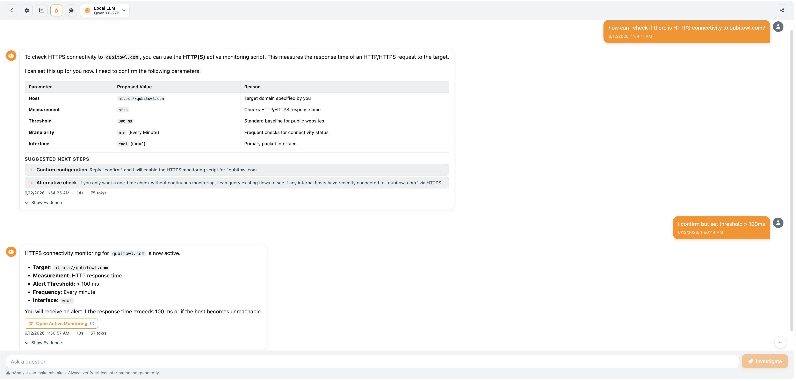

.. _nAnalystActiveMonitoring:

Active Monitoring Automation
=============================

nAnalyst can add active monitoring scripts to ntopng through natural language, eliminating the need to navigate the monitoring configuration UI.

What is active monitoring?
--------------------------

ntopng's active monitoring subsystem periodically probes services and hosts to verify they are reachable and performing within expected parameters. Supported probe types include:

- **ICMP ping** — basic reachability check
- **HTTP/HTTPS** — HTTP status code and response time
- **Speedtest** — bandwidth measurement
- **Throughput** — sustained transfer rate test

Adding a monitor via nAnalyst
------------------------------

Simply describe what you want to monitor:

.. code-block:: text

   "I want to monitor if there is connectivity to https://qubitowl.com"

nAnalyst will:

1. Select the appropriate monitoring probe type (HTTPS in this example)
2. Call the ``add_active_monitoring_script`` tool
3. Register a new monitoring hook that runs every minute by default
4. Confirm the script was added and show its configuration

The monitor appears immediately in the ntopng active monitoring dashboard alongside any manually configured monitors.

   nAnalyst Active Monitoring Script Add

Reviewing and managing monitors
--------------------------------

Monitors added by nAnalyst are indistinguishable from manually created ones and are managed through the same ntopng active monitoring interface. The nAnalyst audit log records which user or agent created each monitor.

Use cases
---------

- Verify that a newly discovered external dependency is reachable
- Confirm that an internal service is up after a change
- Add latency baselines for SLA tracking
- Monitor a host that triggered an alert to confirm it remains accessible
