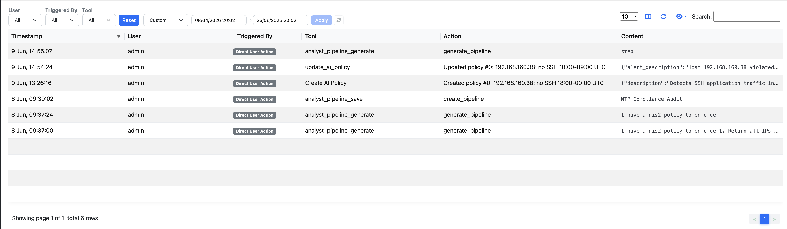

.. _nAnalystAuditLog:

Action Audit Log
================

nAnalyst maintains a comprehensive audit log of every action taken — by users through the chat interface and by the AI agent autonomously. This provides SOC2-style accountability for all AI-assisted operations.

What is logged
--------------

Every time nAnalyst takes an action that modifies ntopng state, an audit record is created. Logged actions include:

- Adding an active monitoring script
- Creating or modifying a network policy
- Registering a new alert rule
- Silencing or creating an alert exclusion (host, domain, certificate)
- Any other tool call that writes to the ntopng configuration or database

Each audit record captures:

- **Action** — what was done (e.g., ``add_active_monitoring_script``)
- **Actor** — the ntopng user who initiated the session
- **Initiator type** — whether the action was requested by the user or suggested and executed autonomously by the agent
- **Tool call content** — the exact parameters passed to the tool
- **Timestamp** — when the action occurred
- **Session ID** — link back to the full conversation that produced this action

Viewing the audit log
---------------------

The audit log is accessible from the nAnalyst observability panel. It can be filtered by:

- User
- Action type
- Time range
- Initiator (user-requested vs. agent-autonomous)

Each row is expandable to show the full tool call payload.

   nAnalyst Audit Log

Blame and attribution
---------------------

The audit log answers two accountability questions:

1. **Who did this?** — every action is attributed to an authenticated ntopng user, even when the action was performed autonomously by the agent following the user's instruction.

2. **Why did this happen?** — the session ID links the action back to the full conversation, including the original user question that led the agent to take the action.

This makes nAnalyst audit-ready for environments that require change accountability, such as SOC operations, compliance audits, and post-incident reviews.

.. note::

   The audit log is append-only. Actions recorded in it cannot be modified or deleted through the nAnalyst UI. Administrative database access would be required to alter audit records.

Compliance use cases
--------------------

- **SOC2 evidence** — demonstrate that all automated network changes have a traceable human initiator
- **Incident post-mortems** — reconstruct the sequence of AI-assisted actions during an incident
- **Change management** — review what configurations nAnalyst modified during a given time window
- **Insider threat monitoring** — detect unusual patterns in AI tool usage by specific users
