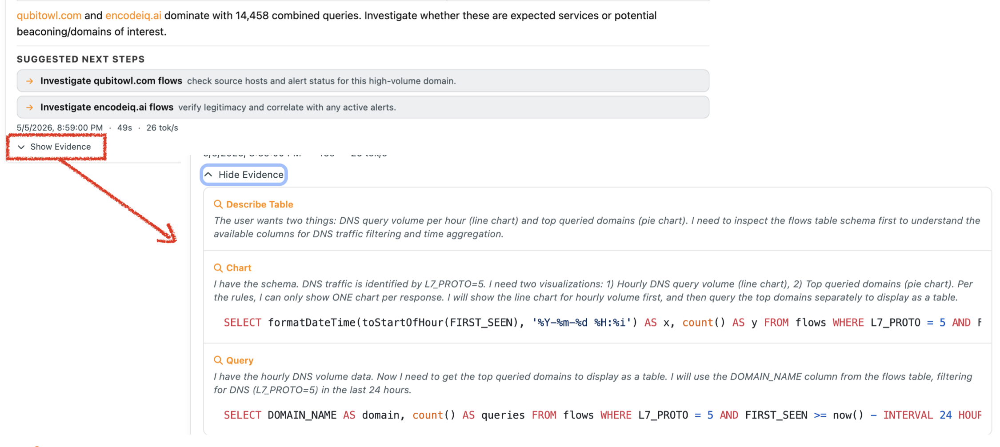

.. _nAnalystNoBlackBox:

Explainability — No Black Box
==============================

A core design principle of nAnalyst is that every answer must be verifiable. Unlike generic AI assistants that produce text with no traceable source, nAnalyst exposes the full chain of reasoning behind every response.

Evidence log
------------

Every chat response includes an evidence log — a structured record of:

- **Tools called** — which of the 25+ domain tools were invoked and in what order
- **SQL executed** — the exact ClickHouse queries run against your data
- **Raw results** — the data returned by each tool call before summarisation
- **Reasoning steps** — the agent's intermediate conclusions as it assembled the answer

The evidence log is collapsed by default to keep responses readable, but is always one click away. You can inspect, copy, or export any part of it.

   nAnalyst Evidence Log

Why this matters
----------------

Black-box AI answers create a trust problem in security contexts. If an analyst cannot verify why the AI reached a conclusion, they cannot rely on it during an incident.

nAnalyst's evidence log means:

- Every claim in the answer maps to a specific data row
- SQL can be copied and re-run independently to validate results
- Investigations are reproducible and shareable across team members
- Evidence can be attached to incident reports or tickets

Interpretable results
---------------------

nAnalyst does not hallucinate network data. It only states facts that are backed by tool-call results. If the data needed to answer a question is not available, nAnalyst says so rather than guessing.

Charts and tables embedded in responses are generated directly from the SQL result sets — there is no additional LLM-driven data transformation between the database and the visualisation. Chart artifacts are rendered in vueJS, so they are fast, reactive and the same components used throughout the ntopng user interface.
