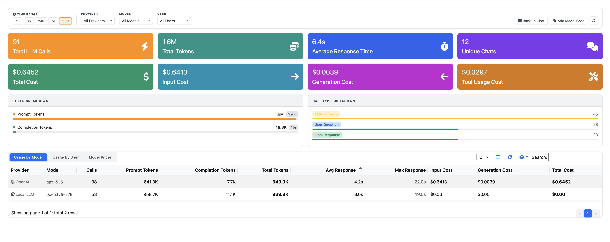
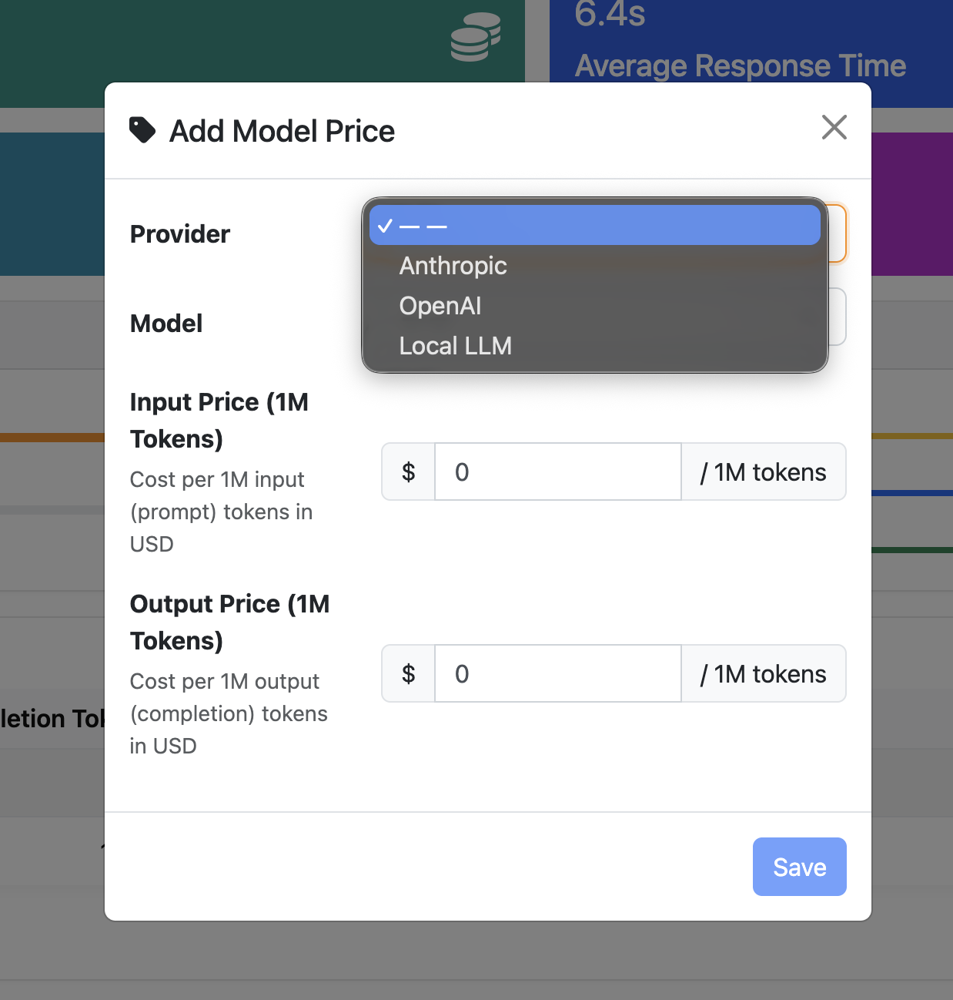

.. _nAnalystUsageStats:

Usage Statistics
================

nAnalyst provides built-in visibility into LLM usage — both in terms of token consumption and dollar cost — broken down by user, model, and operation type.

Why usage tracking matters
---------------------------

LLM-powered tools can generate unexpected costs at scale. nAnalyst makes cost visible and attributable from day one so teams can:

- Budget for AI-assisted investigations
- Identify heavy users or costly query patterns
- Compare cost across different LLM models
- Demonstrate ROI by correlating usage with incidents resolved

Usage dashboard
---------------

The usage statistics page shows:

**Token breakdown**

- Total input and output tokens over a selectable time range
- Per-user token consumption
- Per-LLM model token consumption
- Breakdown by operation type: tool call execution, response generation, context management

**Cost tracking**

- Dollar cost per session, per day, per user
- Cost per model (see model cost configuration below)
- Cumulative spend over time

   nAnalyst Usage Stats

Model costs can be added by clicking on the right part 'Add Model Cost':

   nAnalyst Add LLM Model Cost

Model cost configuration
-------------------------

nAnalyst allows you to configure pricing for any model:

1. Navigate to nAnalyst settings → Model Costs
2. Select an existing model or enter a new model name
3. Enter the input price and output price per 1M tokens
4. Costs are applied retroactively to the historical usage display

This supports accurate cost accounting for:

- Pay-per-use cloud APIs (Anthropic, OpenAI)
- AWS Bedrock per-token pricing
- Local inference servers (set cost to zero or to a compute cost estimate)

Interpreting the data
---------------------

Each row in the usage breakdown corresponds to one nAnalyst session. The columns show:

- **User** — the ntopng user who initiated the session
- **Model** — the LLM model used
- **Input tokens** — tokens sent to the model (questions + tool results + context)
- **Output tokens** — tokens generated by the model (reasoning + answers)
- **Tool calls** — number of domain tool invocations in the session
- **Cost** — estimated dollar cost based on configured model pricing
- **Timestamp** — session start time
