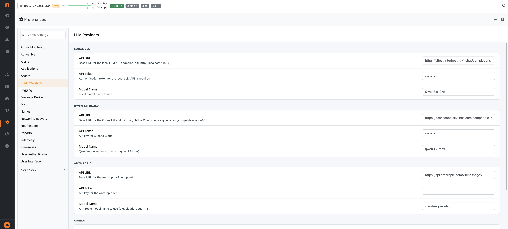
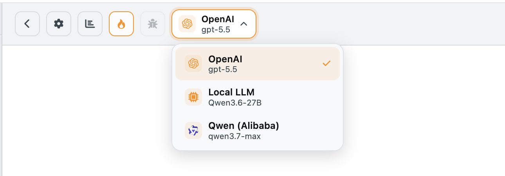

.. _nAnalystLLMSetup:

LLM Setup
=========

nAnalyst requires an LLM backend for reasoning and natural language generation. It supports multiple providers and can run entirely on-premises with a local inference server.

Supported backends
------------------

+---------------------------+-------------------------------------------------------------+
| Backend                   | Notes                                                       |
+===========================+=============================================================+
| `Anthropic (Claude)`_     | Pay-per-use cloud API                                       |
+---------------------------+-------------------------------------------------------------+
| `OpenAI (GPT models)`_    | Pay-per-use cloud API                                       |
+---------------------------+-------------------------------------------------------------+
| `AWS Bedrock`_            | OpenAI-compatible endpoint; regional data residency         |
+---------------------------+-------------------------------------------------------------+
| `Qwen (Alibaba Cloud)`_   | Pay-per-use cloud API; OpenAI-compatible                    |
+---------------------------+-------------------------------------------------------------+
| `llama-cpp`_              | Local inference; OpenAI-compatible server                   |
+---------------------------+-------------------------------------------------------------+
| `vllm`_                   | Local inference; OpenAI-compatible server                   |
+---------------------------+-------------------------------------------------------------+
| `sglang`_                 | Local inference; OpenAI-compatible server                   |
+---------------------------+-------------------------------------------------------------+
| Any OpenAI-compatible API | Set a custom endpoint URL                                   |
+---------------------------+-------------------------------------------------------------+

.. _Anthropic (Claude): https://www.anthropic.com/api
.. _OpenAI (GPT models): https://platform.openai.com/docs/overview
.. _AWS Bedrock: https://aws.amazon.com/bedrock/
.. _Qwen (Alibaba Cloud): https://www.alibabacloud.com/en/solutions/generative-ai/qwen
.. _llama-cpp: https://github.com/ggml-org/llama.cpp
.. _vllm: https://docs.vllm.ai/
.. _sglang: https://docs.sglang.ai/

Configuration
-------------

LLM settings are configured in ntopng under **Settings -> LLM Providers**.

Required fields:

- **API Key** — your LLM provider API key (not required for local servers)
- **Endpoint URL** — the API base URL (default values are pre-filled for Anthropic and OpenAI)
- **Model name** — the model identifier (e.g., ``claude-sonnet-4-6``, ``gpt-4o``, ``qwen3-235b-a22b``, ``llama3.2``)

The API key is stored locally on the ntopng instance and never transmitted to any service other than the configured LLM endpoint.

   nAnalyst LLM Connection Setup

Choosing a model
----------------

**Cloud APIs** offer the highest reasoning quality and are recommended for complex investigations and policy generation. Costs depend on usage volume (see :ref:`nAnalystUsageStats`).

**Local inference servers** provide full data privacy — no data leaves your premises at all, including to the LLM — at the cost of lower reasoning quality for complex tasks. They are suitable for high-volume, simpler queries or environments with strict data sovereignty requirements.

.. tip::

   For optimal results, use a model with a context window of at least 32k tokens. Larger context windows allow nAnalyst to include more evidence in a single reasoning step.

Switching models
----------------

You can change the active LLM model at any time from the LLM model panel. Existing conversations retain their original model metadata in the usage log. New messages will use the newly chosen model.

   nAnalyst Switch LLM Model
