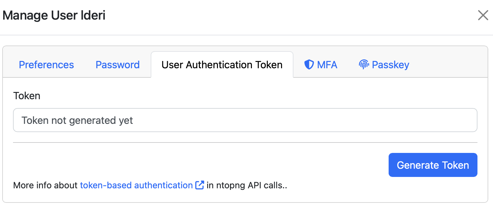

.. _nAnalystMCP:

MCP Server
==========

nAnalyst exposes all of its network intelligence tools as a Model Context Protocol (MCP) server running on your ntopng instance. This allows any MCP-compatible AI client — such as Claude Code, Cursor, or a custom agent — to query ntopng data and take actions directly.

What is MCP?
------------

The `Model Context Protocol <https://modelcontextprotocol.io>`_ is an open standard that lets AI applications connect to external tools and data sources through a defined interface. An MCP server exposes a set of tools that any compatible LLM client can discover and call.

ntopng's MCP server makes the full nAnalyst tool set available to external clients without any additional installation.

Connecting an MCP client
------------------------

No additional software needs to be installed on the ntopng host. The MCP server runs as part of ntopng and is available as soon as nAnalyst is enabled.

**Claude Code**

To connect to the internal ntopng MCP server, simply type the following command on the machine running claude code:

.. code-block:: javascript

  claude mcp add-json ntopng \
  '{"type":"http","url":"http://NTOPNG_URL:NTOPNG_PORT/lua/rest/v2/exec/llm/mcp.lua","headers":{"Authorization":"Token YOUR_TOKEN"}}' \
  --scope user

Authentication
--------------

MCP requests are authenticated using ntopng API keys. Keys are generated and managed in ntopng under **User -> User Authentication Token**. Assign appropriate permissions to the key based on whether the client needs read-only access or the ability to create policies and monitoring scripts.

.. note::

  The MCP server honours ntopng's existing role-based access control. A key with read-only permissions cannot create policies or add monitoring scripts even if the client requests it.

   ntopng Auth Token

**Cursor and other MCP clients**

Use the same endpoint URL and authentication header. Refer to your client's MCP configuration documentation for the exact format.

Available tools via MCP
------------------------

The MCP server exposes all nAnalyst domain tools, including:

- ``get_live_flows`` — query currently active flows
- ``get_historical_flow`` — search historical flow records
- ``get_host_info`` — retrieve host metadata and statistics
- ``get_asset_info`` — query asset inventory
- ``get_snmp_device_info`` — retrieve SNMP device data
- ``chart`` — generate time-series or ranked charts
- ``query`` — execute arbitrary ClickHouse SQL
- ``add_active_monitoring_script`` — register a new monitoring probe
- ``create_ai_policy`` — create a policy from a natural language description
- ``list_protos`` — enumerate nDPI-detected application protocols
- And 15+ additional tools

Use cases
---------

**Analyst with Claude Code**

An analyst running Claude Code on their workstation can connect to ntopng and investigate incidents using natural language — without opening a browser. The full nAnalyst reasoning capability is available through the terminal.

**Custom agents**

Security teams can build custom automation agents that call ntopng tools as part of a larger workflow — for example, an agent that correlates ntopng flow data with SIEM events or a ticketing system.

**CI/CD and runbooks**

Operational runbooks can query ntopng programmatically via MCP to verify network state before or after deployments.

Further reading
---------------

- `Model Context Protocol specification <https://modelcontextprotocol.io>`_
- `Claude Code MCP documentation <https://docs.anthropic.com/en/docs/claude-code/mcp>`_
- `Cursor MCP guide <https://docs.cursor.com/context/model-context-protocol>`_
- `ntopng REST API documentation <https://www.ntop.org/guides/ntopng/api/>`_
