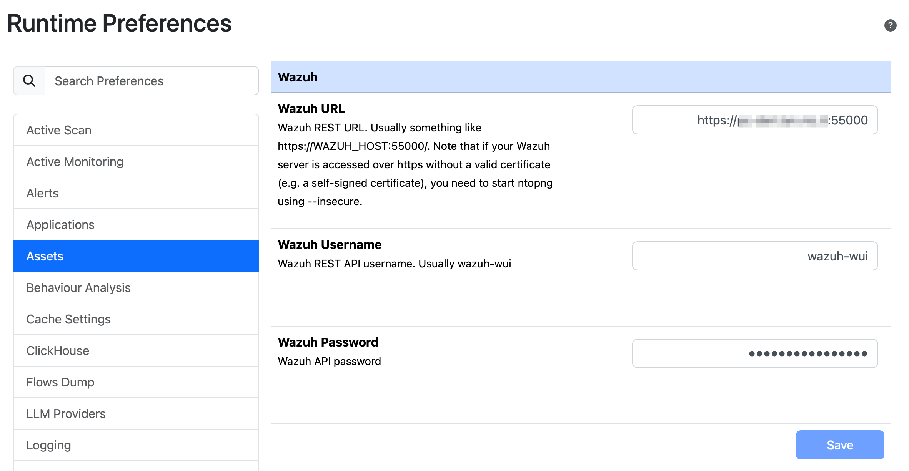
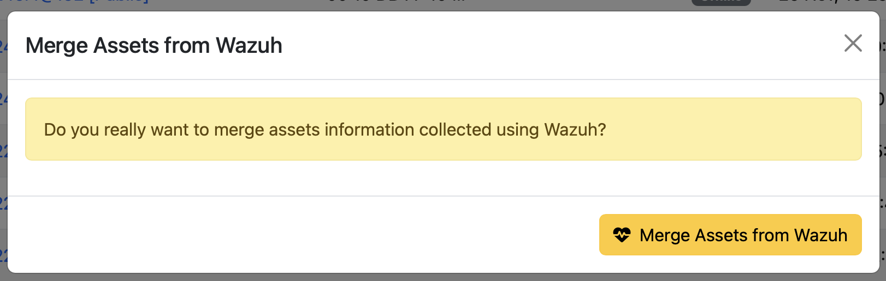
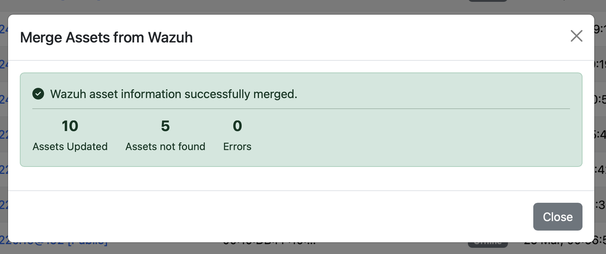
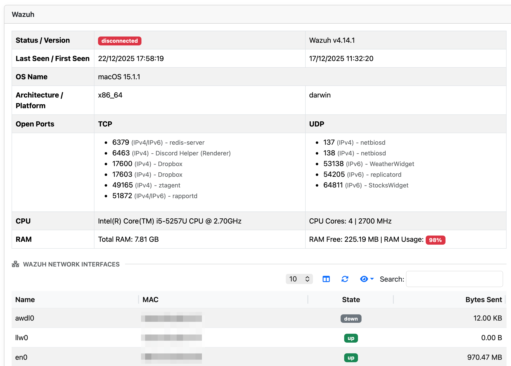
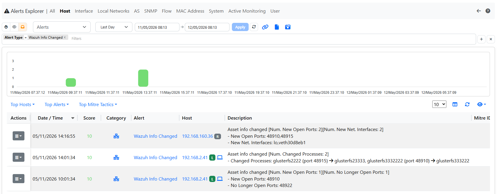

.. _WazuhIntegration:
 
Wazuh Integration
#################
 
ntopng integrates with `Wazuh <https://wazuh.com>`_, an open-source security platform that provides threat detection, integrity monitoring, incident response, and compliance capabilities. This integration enriches the ntopng asset inventory by merging endpoint security information, collected by Wazuh agents, directly into ntopng host assets, giving operators a unified view of both network traffic and host security posture.
 
Overview
========
 
Wazuh deploys agents on monitored endpoints that continuously report status, operating system details, connectivity information, and security events to a central Wazuh Manager. By connecting ntopng to the Wazuh Manager REST API, the asset inventory can be automatically enriched with this agent-level data.
 
The merge process matches Wazuh agents to ntopng assets based on their IP addresses. When a match is found, the asset is updated with security metadata retrieved from Wazuh, including the agent status, operating system, registration date, and last keep-alive timestamp. Assets enriched with Wazuh data are visually distinguishable in the inventory and can be filtered separately from assets without Wazuh information.
 
Prerequisites
=============
 
Before enabling the integration, ensure the following requirements are met:
 
**ntopng Requirements:**
 
- ntopng with asset inventory support enabled (Enterprise M or better).
- Network connectivity from the ntopng host to the Wazuh Manager API endpoint.
- Host assets already present in the ntopng asset inventory (the integration updates existing assets only; it does not create new ones)
 
**Wazuh Requirements:**
 
- A running Wazuh Manager instance
- A Wazuh user account with read access to the ``/agents`` API endpoint
- The Wazuh Manager API reachable on its configured port (default: ``55000``)
 
.. note::
   The integration performs a read-only query against the Wazuh API. No data is written to Wazuh.
 
Setup
=====
 
Step 1: Configure Wazuh Credentials in ntopng
----------------------------------------------
 
Before triggering a merge, you must provide ntopng with the connection details for your Wazuh Manager.
 
1. Open ntopng and navigate to **Settings → Preferences → Assets → Wazuh**
2. Fill in the following fields:
 
   - **Wazuh URL**: The base URL of the Wazuh Manager API, including the protocol and port (e.g. ``https://WAZUH_HOST:55000``). Note that if your Wazuh server is accessed over https without a valid certificate (e.g. a self-signed certificate), you need to start ntopng using --insecure.
   - **Username**: The Wazuh user account that ntopng will use to authenticate against the API (Usually wazuh-wui)
   - **Password**: The password for the above account
 

 
3. Save the settings
 
Step 2: Merge Assets from Wazuh
--------------------------------
 
Once the credentials are saved, you can trigger the merge at any time from the asset inventory.
 
1. Navigate to **Hosts → asset inventory**
2. Click the **Merge Assets from Wazuh** button in the toolbar
3. ntopng will authenticate against the Wazuh Manager API, retrieve the full list of registered agents, and update all matching assets
 

 
  Wazuh Merge Check
  
The operation runs synchronously and returns a brief summary indicating how many assets were updated, how many agents had no matching ntopng asset, and whether any errors occurred.
 

 
  Wazuh Merge Completed
  
.. note::
   Only assets that already exist in the ntopng inventory are updated. Wazuh agents whose IP address does not match any known ntopng asset are silently skipped and counted as "not found" in the summary.
 
 
In case you want to nightly automatically synchronize Wazuh with ntopng, you can avoid manual import and set this option in the wazuh preferences.
 
Step 3: Review Enriched Assets
-------------------------------
 
After the merge completes, enriched assets can be identified and inspected in two ways.
 
**Visual indicator in the inventory**
 
Assets that have been successfully enriched with Wazuh data display a **W** badge next to their name in the asset inventory table, making them immediately recognisable at a glance.
 
**Filtering by Wazuh status**
 
The asset inventory provides a dedicated filter to narrow the view to:
 
- Assets **with** Wazuh information (merge was performed and data is available)
- Assets **without** Wazuh information (no merge has been performed, or no matching Wazuh agent was found)
 
This filter is useful to quickly identify which endpoints in your network are covered by Wazuh monitoring and which are not.
 
**Wazuh detail panel**
 
Clicking on an enriched asset opens its detail page, where a dedicated **Wazuh** section is displayed. This section contains a table with the following information retrieved from the Wazuh agent record:
 
.. list-table::
   :header-rows: 1
   :widths: 30 70
 
   * - Field
     - Description
   * - **Status**
     - Current agent status as reported by Wazuh (e.g. ``active``, ``disconnected``, ``never_connected``)
   * - **Version**
     - Version of the Wazuh agent installed on the endpoint
   * - **Date Added (First Seen)**
     - Date and time the agent was first registered with the Wazuh Manager
   * - **Last Keep-Alive (Last Seen)**
     - Date and time of the most recent heartbeat received from the agent
   * - **OS**
     - Operating system information of the monitored endpoint
 
.. note:: Timestamp fields are stored and displayed in UTC, consistent with the rest of ntopng.
 
 

 
  Wazuh Agent Information
  
 
Above you can see an example of the information reported by Wazuh that includes (but not limited to)
 
- Operating System and Architecture
- Available resources (memory and CPU)
- Network Interfaces
- Open TCP/UDP server ports including process name

 
Alerts
======
 
Every time a Wazuh merge is performed, ntopng compares the newly retrieved agent data against the previously stored state for each asset and automatically generates **informative alerts** for any change detected. These alerts are visible under the **network interface** and are labelled with the IP address of the affected host. 
 

Alert triggers
--------------
 
An alert is generated for each of the following events:
 
.. list-table::
   :header-rows: 1
   :widths: 35 65
 
   * - Event
     - Description
   * - **New open port**
     - A TCP or UDP port that was not previously open is now reported as open by the Wazuh agent.
   * - **Port no longer open**
     - A TCP or UDP port that was previously open is no longer present in the agent report.
   * - **Process behind a port changed**
     - A port is still open, but the process (application) listening on it has changed since the last merge.
   * - **Network interface added**
     - A new network interface has appeared on the endpoint. Virtual interfaces whose name starts with ``veth`` are excluded from this check as they are not considered meaningful (e.g. container-generated interfaces).
   * - **Network interface removed**
     - A previously known network interface is no longer reported by the agent. As above, ``veth``-prefixed interfaces are ignored.
 
New assets
----------
 
When a Wazuh agent is matched to an ntopng asset **for the first time** (i.e. the asset has no prior Wazuh data), ntopng treats the entire set of data received as new and generates a single alert that summarises all ports, processes, and network interfaces discovered on that endpoint. This provides an immediate baseline notification whenever a previously unknown host is enrolled.
 
Alert format
------------
 
All Wazuh-generated alerts share the following properties:
 
- **Severity**: Informative
- **Interface**: The network interface where ntopng observes the host
- **Label**: IP address of the affected host
 
This makes it straightforward to correlate alerts with specific hosts directly from the ntopng alert view, and to filter or aggregate them by IP address across the fleet.
 
 
Keeping Data Up to Date
=======================
 
The Wazuh integration does not poll the Wazuh API continuously. The merge must be triggered manually from the asset inventory, or scheduled nightly via the automatic synchronization option in the Wazuh preferences.
 
Troubleshooting
===============
 
**The "Merge Assets from Wazuh" button returns an error**
 
- Verify that the Wazuh URL, username, and password saved are correct
- Confirm that the Wazuh Manager API is reachable from the ntopng host on the configured port
- Check that the Wazuh user account has permission to call the ``/agents`` endpoint
- Inspect the ntopng log for additional error details
 
**Agents are retrieved but no assets are updated**
 
- The merge matches agents to assets exclusively by IP address. Ensure that the IP addresses reported by Wazuh agents correspond to IPs already present in the ntopng asset inventory
- Assets that have never been seen by ntopng cannot be created by the merge; traffic must be observed first for an asset to exist in the inventory
 
**The "W" badge does not appear after the merge**
 
- Reload the asset inventory page; the badge is rendered client-side and may require a page refresh
- Confirm the merge summary reported at least one updated asset
 
**No alerts are generated after the merge**
 
- Alerts are only generated when a change is detected relative to the previous merge. If this is the first merge ever performed, a baseline alert is created for each newly matched asset. If no changes occurred since the last merge, no alerts are produced.
- Confirm that the alerts view is filtered to show the correct network interface, as Wazuh alerts are associated with the interface on which the host is observed by ntopng.