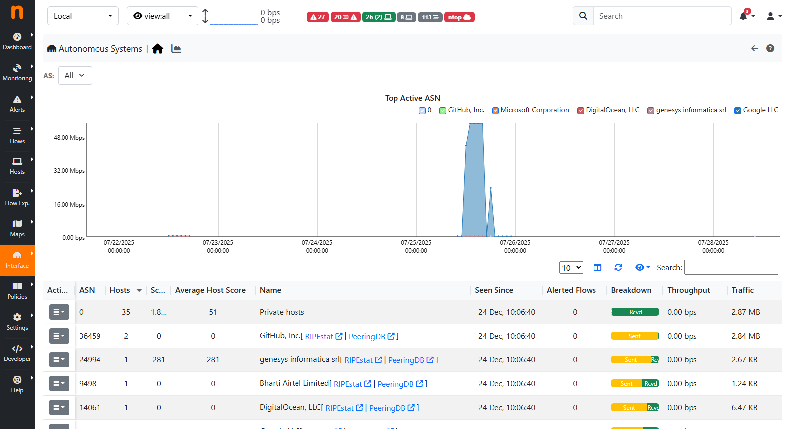
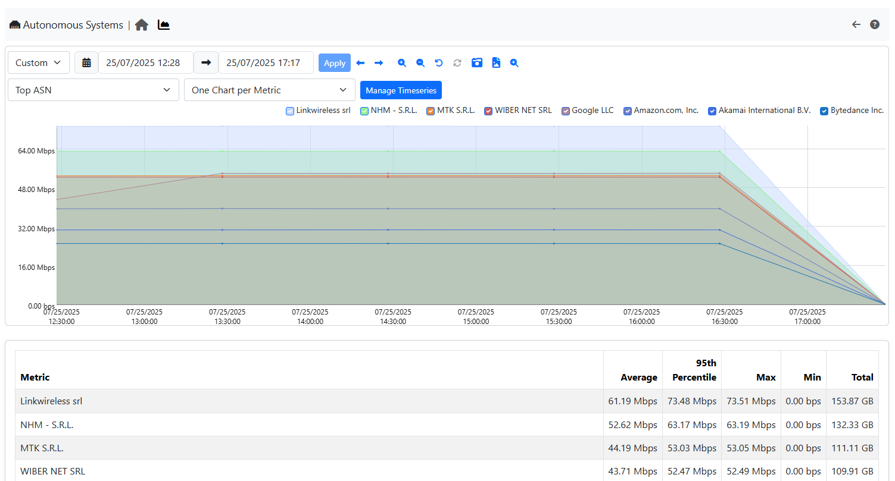
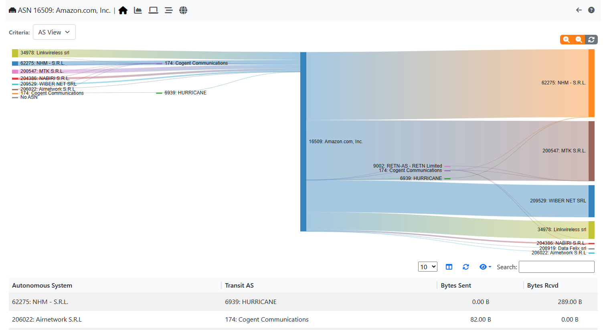
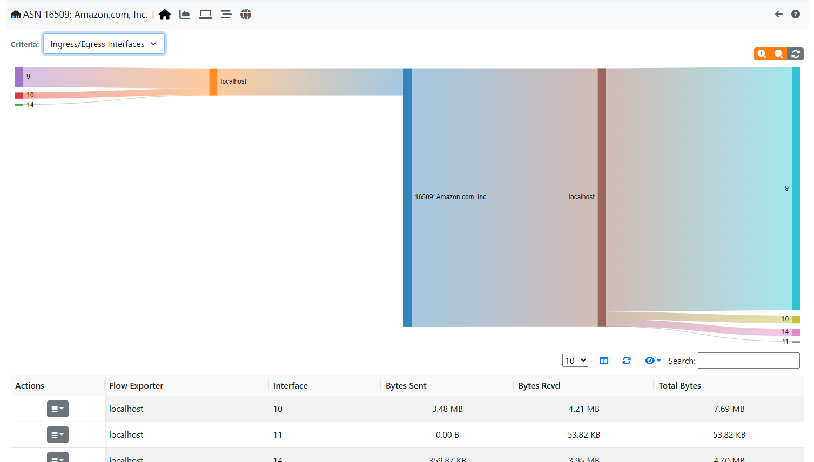

.. _AutonomouseSystems:

Autonomous Systems
------------------

Autonomous Systems shows all autonomous systems discovered by ntopng. Autonomous Systems require :ref:`Geolocation` enabled.

  The Hosts Autonomous Systems Summary Page

Ntopng uses a Maxmind database to gather information about Autonomous Systems (AS) and based on
this it groups hosts belonging to the same AS. AS number 0 contains all hosts having private IP addresses.
In the Timeseries (only available if enabled) are shown the top current active Autonomous Systems with the traffic
done in the last week (7 days).

There are four different possible actions available in the Actions button (Action column of the table):

- Timeseries
- Ingress/Egress Stats
- Hosts
- Flows

Timeseries
^^^^^^^^^^

  The Top ASN Timeseries

.. warning::

  To be able to see the Timeseries, they must be enabled from the Settings (Timeseries section).

It is possible to access the Autonomous Systems Timeseries in two different ways:

- By clicking on the Action (button) -> Timeseries, in this way the timeseries of the selected AS are shown;
- By clicking on the Chart Icon on the Navigation bar (above the `Top Active ASN` chart), in this way all the AS timeseries of the selected Interface are shown;

.. warning::

  In case many Autonomous Systems are present, the loading of all the Timeseries (second option above) could may take a while

Ingress/Egress Stats
^^^^^^^^^^^^^^^^^^^^

This page is used to understand, each AS, where it is sending/receiving the traffic.

  The Autonomous Systems View

There are two different Criteria:

- AS View;
- Ingress/Egress Interfaces;

In the first case the statistics of each AS that are talking to other ASes are shown. Also the Transit AS are shown here (for example ASN 174 is talking to ASN 16509 by using ASN 6939 as Transit).
The table shows the same data as the sankey but in a table view (sortable and searchable).

.. note::

  The table below is available only from Enterprise L license

  The Autonomous Systems View

In the second view instead, it's shown from which exporter and interface each AS is sending/receiving traffic.

.. note::

  The second view is only available if there is at least an exporter sending traffic towards ntopng (see :ref:`UsingNtopngWithNprobe`)

Hosts/Flows
^^^^^^^^^^^

All the hosts or flows being part of the selected Autonomous System, are shown on the respective :ref:`Hosts` and :ref:`WebGuiFlows` pages
