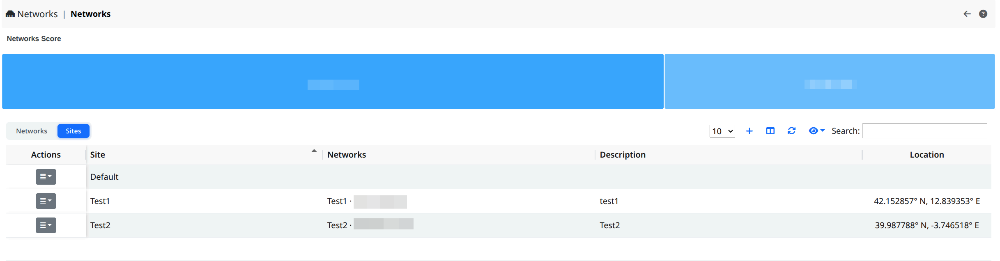
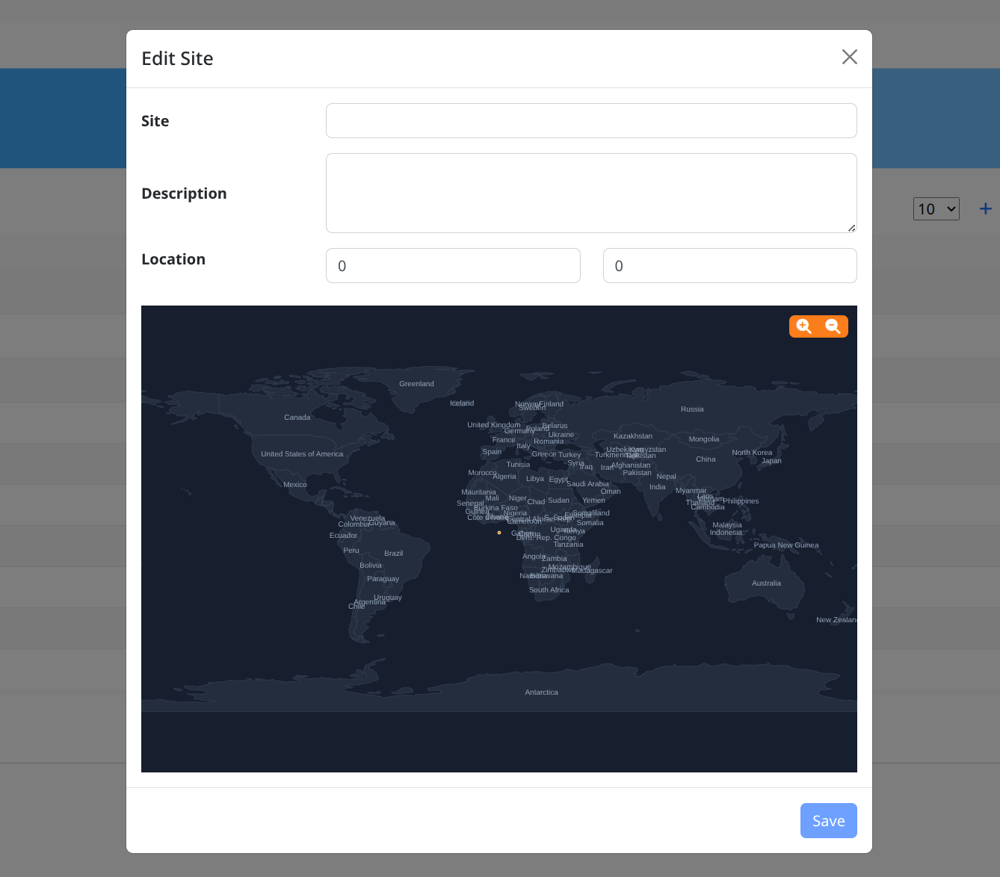
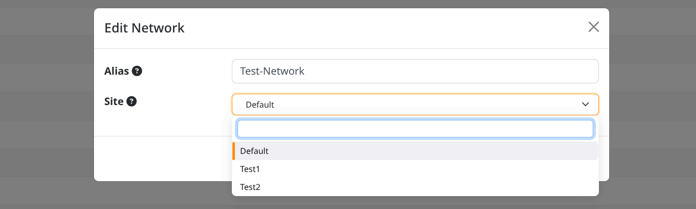

.. _Sites:

Sites
-----

A *Site* is a named place - typically a physical location such as an office, a branch,
or a data center - to which one or more networks can be assigned. Sites let you
group networks by location, so that hosts, traffic, score and alerts can be reviewed per
place rather than per individual network. A site can optionally be pinned on a map through
its geographic coordinates.

.. note::

  Sites are available with an Enterprise M (or higher) license.

Sites are managed from the `Networks`_ page. At the top of the page two tabs are available,
**Networks** and **Sites**: select the **Sites** tab to switch to the sites view.

.. _`Networks`: networks.html

  The Sites Page

For each site the following information is shown:

- **Name**: the display name of the site.
- **Description**: an optional free-text description.
- **Networks**: the networks currently assigned to the site.
- **Location**: the site coordinates (latitude and longitude). The location is shown only
  when coordinates have been set.

The Default Site
^^^^^^^^^^^^^^^^^

A predefined **Default** site is always present and cannot be removed. Every network
that has not been explicitly assigned to a site belongs to the Default site, which therefore
acts as a fallback. Being a reserved site, the Default site cannot be edited or deleted, and
its actions are disabled in the table.

Adding a Site
^^^^^^^^^^^^^

From the **Sites** tab, click the **+** button at the top of the table to open the creation
form, then fill in the following fields:

- **Name** (required): from 2 to 32 characters. Only letters, numbers and spaces are allowed
  (accented letters are accepted). The name must be unique: two sites cannot share the same name.
- **Description** (optional): up to 256 characters.
- **Location** (optional): set the position either by typing the **Latitude** and **Longitude**
  values, or by clicking directly on the map below the fields. The map marker and the coordinate
  fields stay in sync, so a click updates the values and typing updates the marker. Latitude must
  be between -90 and 90, longitude between -180 and 180. 

  The Site creation / edit form

Click **Save** to create the site. If a value is not valid (for example a duplicate name) the
form reports the error and the site is not saved.

Editing a Site
^^^^^^^^^^^^^^

In the **Sites** tab, use the edit action on a site row to reopen the same form with the current
values pre-filled. Update the fields as needed and click **Save**. The Default site is reserved
and cannot be edited.

Deleting a Site
^^^^^^^^^^^^^^^

Use the delete action on a site row and confirm to remove the site. The Default site is reserved
and cannot be deleted.

.. note::

  Deleting a site does not prevent removal when networks are still assigned to it. Any network
  that was assigned to the deleted site falls back to the Default site.

Assigning a Network to a Site
^^^^^^^^^^^^^^^^^^^^^^^^^^^^^^

Networks are not assigned to a site from the site form. Instead, the assignment is done from the
**Networks** tab: edit a network and choose the desired site from the list. The **Site** column in
the networks list shows the site each network currently belongs to. Networks left unassigned remain
part of the Default site.

  :align: center
  :alt: Edit the Network Site

  The Network edit form

