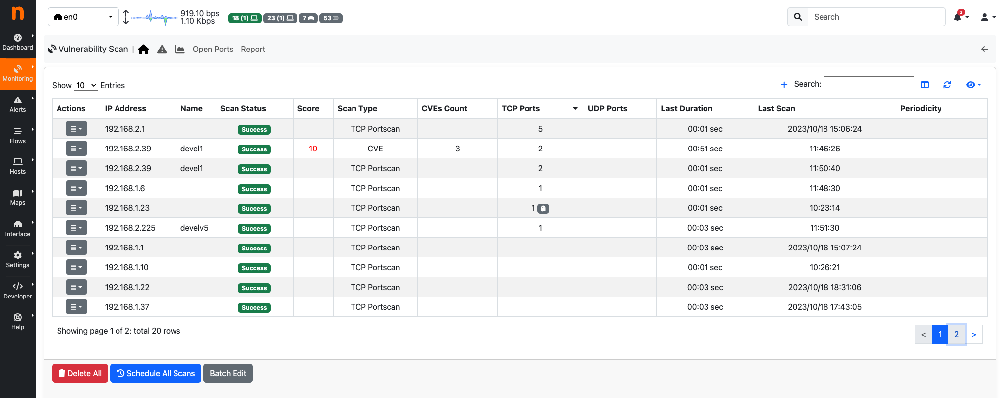
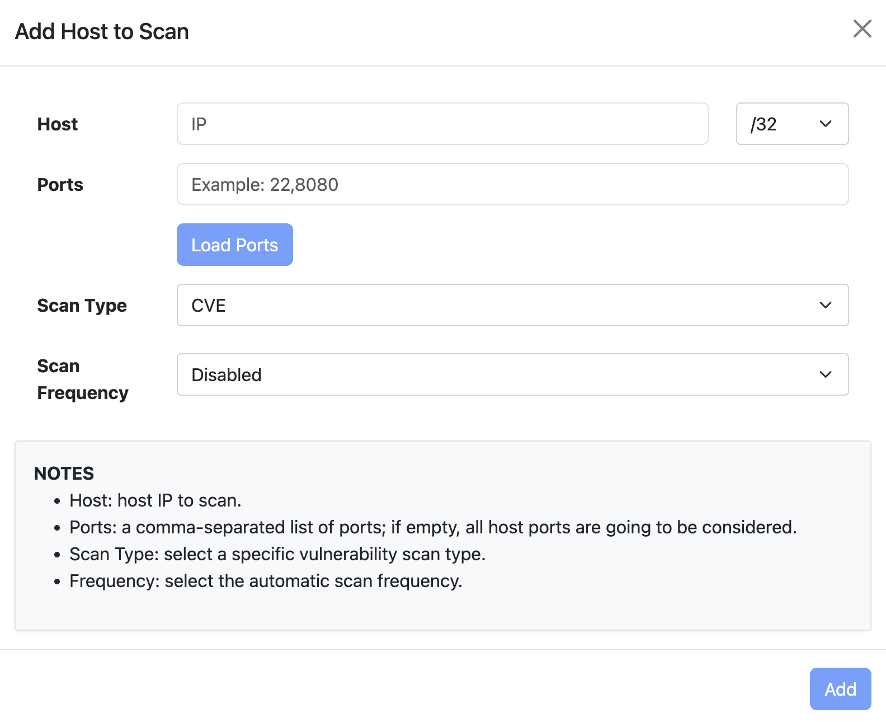
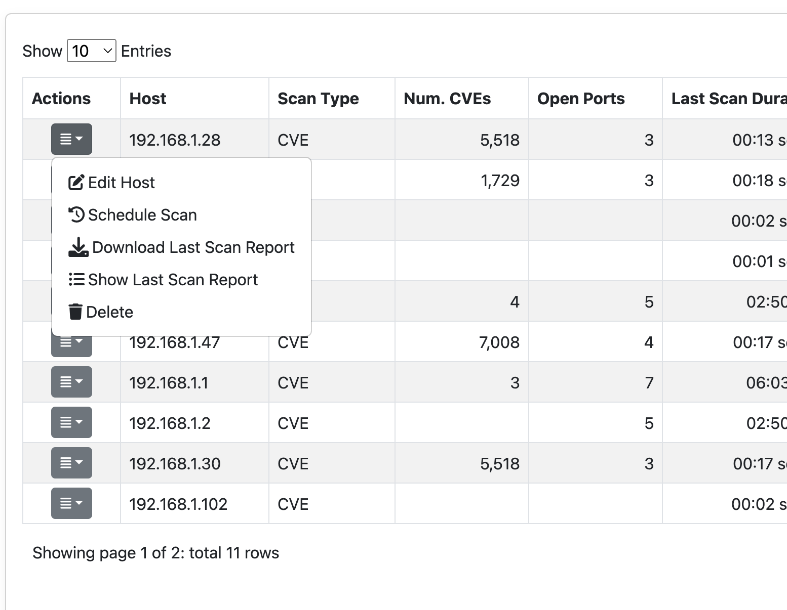
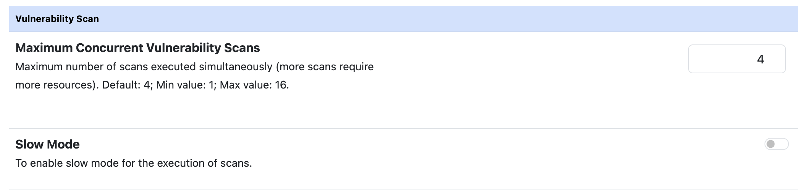
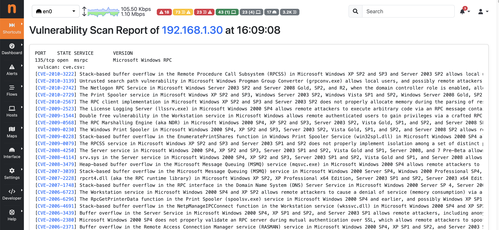
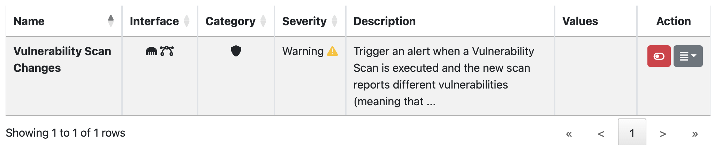
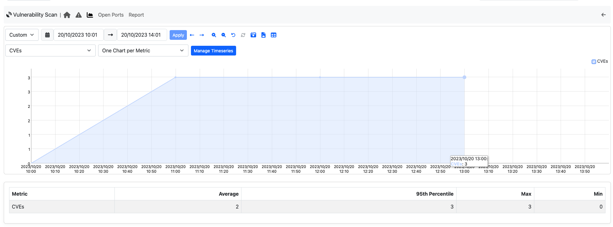
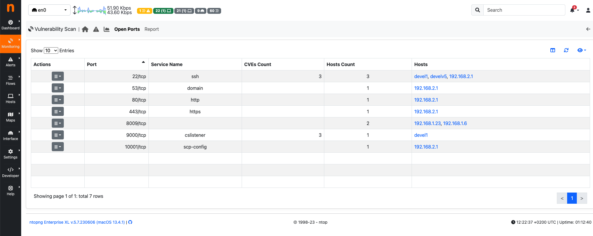
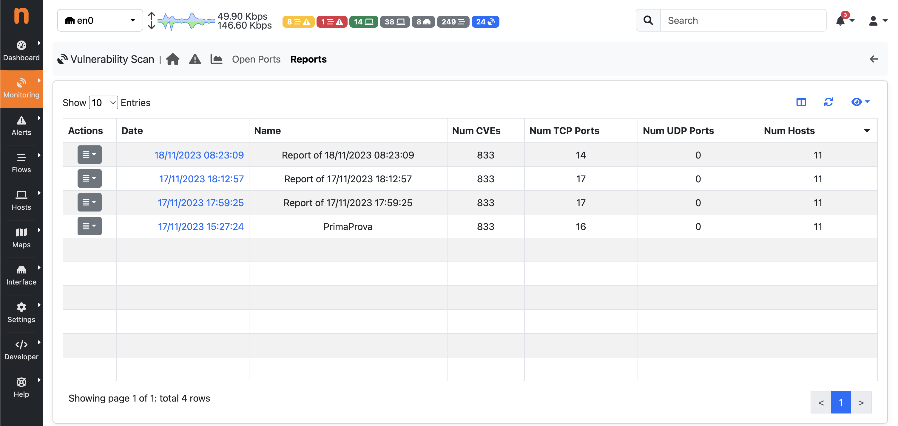
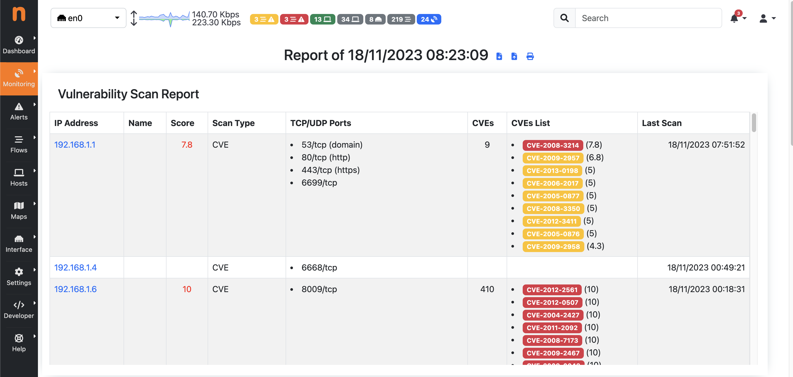

Active Scan
###########

.. warning::

  This feature support is not available on Windows.

ntopng is able to both passively monitor network and perform a scan, whose goal is to discover TCP or UDP open ports in provided services.

The current implementation leverages on `nmap <https://nmap.org>`_. The code is designed to add new scanner types by simply defining new `modules <https://github.com/ntop/ntopng/tree/dev/scripts/lua/modules/vulnerability_scan/modules>`_.

Active Scan Page
~~~~~~~~~~~~~~~~

  Active Scan Page

On the Active Scan page, it is possible to view the registered hosts that can be scanned, along with various details about the last executed scan, such as:

- Scan Status (can be "Scanning", "Scheduled", "Success", "Not Scanned", "Error");
- Scan Type;
- TCP Ports (number of open TCP ports found);
- UDP Ports (number of open UDP ports found);
- Last Duration;
- Last Scan;
- Periodicity

After the ntopng execution of a TCP or UDP Portscan, ntopng compares the open ports detected by the network monitoring with the open ports discovered during the scan:

- If the Active Scan identifies an open TCP (or UDP) port that is not currently in use according to network monitoring results, a ghost icon |ghost| will be displayed near the number of open TCP (or UDP) ports of the specific host; 
- If the Active Scan fails to identify a TCP (or UDP) port that is actually in use, but ntopng has detected it through network monitoring (the port was filtered by the Active Scan), a filter icon |filter| will be displayed near the number of open TCP (or UDP) ports for the specific host.

At the bottom of the page, there are three buttons:

- Delete All (to remove all hosts from the active scan list);
- Schedule All Scans (to schedule a scan for all hosts in the active scan list);
- Batch Edit (to update the periodicity scan for all hosts in the active scan list);

At the end of a `Scan All` execution, if a notification endpoint and the related recipient have `Notification Type` set to `Active Scan Reports`, a notification is sent when the periodic scan ends.

Add Host to Active Scan List
---------------------------------

  Add Host to Active Scan List

By clicking on the '+' icon on the Active Scan page, the user can add a new host or include all hosts active under a specific CIDR.

If a user designates a specific active host, ntopng will automatically populate the Ports field with the known server ports of such other. If unknown the field will be empty and all the ports will be checked. Note that scanning all ports can require a long amount of time, hence we suggest (if possible) to limit the scan to a small port set.

After selecting the host and ports, it is mandatory to choose one of the Active Scan Types. 
Currently, two types of scans are supported:

- TCP Portscan
- UDP Portscan

.. warning::

  The 'UDP Portscan' is available only on Linux.

Periodic Scans
--------------

.. note::

   Periodic Scans require ntopng Enterprise L or better.

Scans can be performed on demand (one shot) or periodically. You have the option to specify a daily scan (performed every days at midnight) or weekly (every Sunday at midnight). In order to avoid hogging the network with aggressive scans, only one scan at time is performed.

If a notification endpoint and the related recipient with the 'Notification Type' set to 'Active Scan Reports' are enabled, a notification is sent when the periodic scan ends.

Actions
-------

  Row Actions menu 

Clicking on the 'Actions' dropdown of a specific row provides the following options:

- Edit Host (to modify the specifications of the selected row);
- Schedule Scan (to schedule the scan for the selected host);
- Download Last Scan Report (to download the file containing the most recent scan result); 
- Show Last Scan Report (to display the last scan result in a new page of ntopng);
- Delete (to delete the specific host from the scan list); 

Settings
--------

  Active Scan Preferences

Under the `Active Scan` tab of the Preferences page, it is possible:

- To modify the maximum number of scans executed simultaneously. The default value is 4, with a minimum of 1 and a maximum of 16.
- To enable the slow scan mode to decrease the aggression level of the scan.

Active Scan Last Report Page
~~~~~~~~~~~~~~~~~~~~~~~~~~~~

  Active Scan Last Report Page

Clicking on the `Show Last Scan Report` button in the Actions dropdown menu of a specific row allows ntopng to display the last scan report for the selected host.

Alerts
~~~~~~

If scans are performed periodically, ntopng compares each scan iteration and it generates alerts when someting changes such as a new port is open or the number of CVEs changed. Alerts needs to be enabled in the Behavioural Checks page as follows

Generated alerts can be accessed from the Alerts Explorer page under the Active Monitoring menu.

Charts
~~~~~~

On the Active Scan Charts page ntopng shows the charts of timeseries filled with scan data.

Ntopng currently records the following data:

- Hosts (number of hosts ready to be scanned);
- Open Ports (number of open ports discovered);
- Scanned Hosts (number of scanned hosts);

Open Ports
~~~~~~~~~~

On the Open Ports page, it is possible to display the list of TCP and UDP open ports detected by the Active Scan, along with the following information:

- Service Name;
- Hosts Count;
- Hosts (the list is limited to five hosts if more than five are available);

By clicking on the `Show Hosts` button in the Actions dropdown menu of a specific row, ntopng allows the user to navigate back to the Active Scan Page and view the hosts with the selected open port.

Scan Reports
~~~~~~~~~~~~

.. note::

   Reports page require ntopng Enterprise L or better.

.. note::

    If ClickHouse is disabled, the ntopng displays the 'Report' page, showing information from the last scan executions instead of the 'Scan Reports' page.

When ClickHouse is enabled, on the Reports page, all reports automatically generated by ntopng are listed. 

By clicking on the actions menu of a single report, it is possible to edit the name of the report or delete the report.

Clicking on the date of a row allows users to jump to display the details of the selected report.

A report is generated:

- At the end of periodic scans;
- After all scan executions initiated by clicking on the 'Schedule All Scans' button;
- At the end of an individual scan;

A active scan report is made up of four differently reports: the Active Scan Report, the CVEs Count, the TCP Ports, and the UDP Ports.

Active Scan Report
------------------

.. figure:: ../../../img/vs_report.png
  :align: center
  :alt: Active Scan Report

The Active Scan Report shows the following information:

- IP Address;
- Name (Host Name);
- Scan Type;
- TCP/UDP Ports (List of open TCP/UDP ports);
- Last Scan (Date of most recent scan execution);

It is possible to jump to the 'Active Scan Last Report Page' specific to that host by clicking on the IP address.

TCP Ports Report
----------------

.. figure:: ../../../img/tcp_ports_report.png
  :align: center
  :alt: TCP Ports Report

The TCP Ports Report shows the following information:

- Port (formatted as: `<portID/tcp (service name)>`);
- Hosts Count;
- Hosts;

UDP Ports Report
----------------

.. figure:: ../../../img/udp_ports_report.png
  :align: center
  :alt: UDP Ports Report

The UDP Ports Report shows the following information:

- Port (formatted as: `<portID/udp (service name)>`)
- Hosts Count;
- Hosts;
