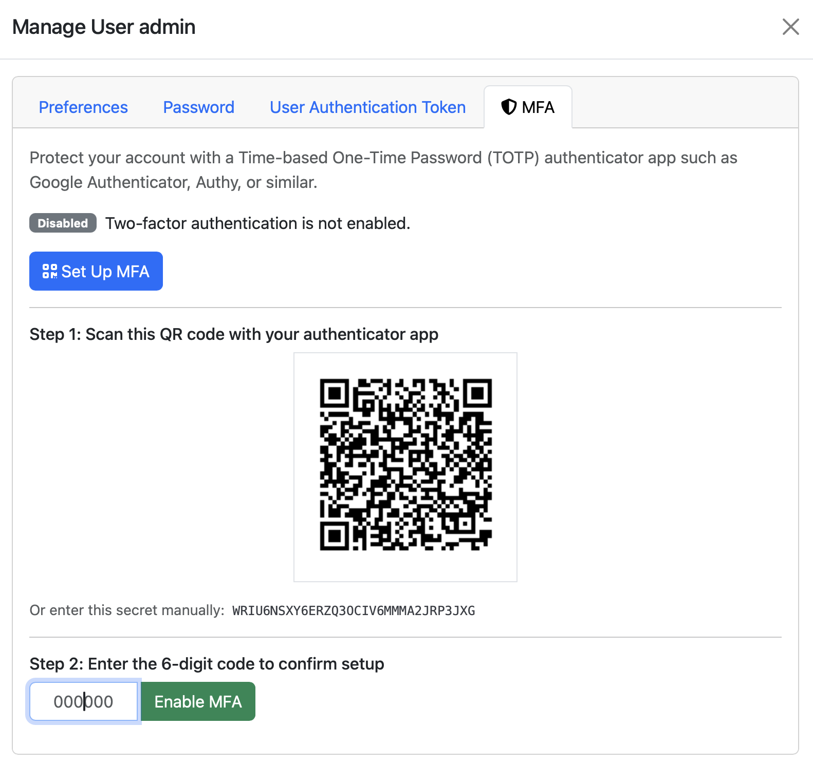
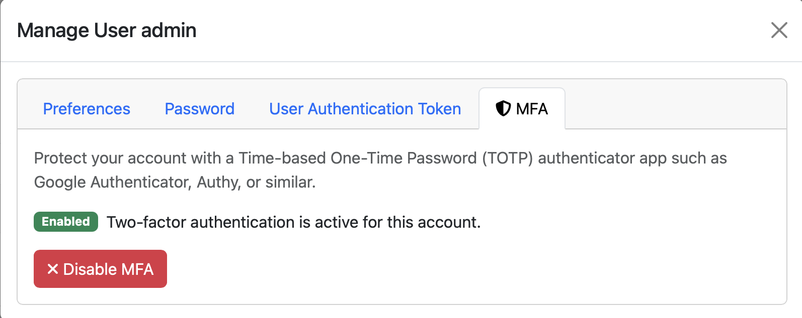
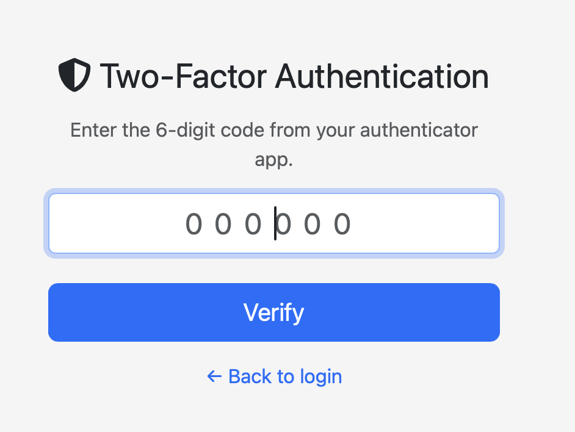

Users
=====

Users menu gives access to ntopng users administration. Ntopng is a multi-user system that
handles multiple simultaneous active sessions. Ntopng users can have the role of Administrators or
standard users.

.. figure:: ../../../img/web_gui_settings_users.png
  :align: center
  :alt: Users Settings

  The Manage Users Settings Page

Password and other preferences can be set during user creation and changed later on by clicking
on the Manage button. User preferences include:

- The user role (Administrator or Not Privileged)
- Allowed interface
- Allowed networks in traffic visualization
- Permission to download live traffic and PCAPs (honoring the interface and networks restrictions)

  
Multi-Factor Authentication
---------------------------

Multi-Factor Authentication (MFA) is a security system that requires users to provide two or more verification factors to gain access to a resource such as an application, online account, or VPN. You can enable MFA on an existing user by clicking on the MFA tab.

  Enable User MFA

You have to scan the QR code using a Time-based One-Time Password (TOTP) authenticator app such as Google Authenticator, Authy, or similar. Done that you need to enter the OPT (One Time Password) generated by the app in the auhtnetication field and click on the Enable button.

  User with MFA Enabled

Whenver you login to ntopng using username and passowrd with a user with MFA enabled, ntopng shows you a page where you need to specify the OTP
  

  Login of a User with MFA Enabled

If you fail to enter the MFA code, login will not be completed.

  
Multitenancy
------------

`Multitenancy <https://en.wikipedia.org/wiki/Multitenancy>`_ is the ability to monitor information coming from various users (e.g. a span port) and show to individual users only the portion of traffic that they have generated or received, hiding all the rest of the traffic.

In order to do this you need to configure users by limiting their visibility to the subset of information they should view.

.. figure:: ../../../img/multiuser.png

You can restrict users by means of:

  - Limiting their visibility to a selected network interface
  - Restricting the visibility only to specific hosts by setting the list of subnets they can view.

This setting in the User's page these properties.

You can dive into multitenancy by reading this `blog post <https://www.ntop.org/ntopng/using-multitenancy-in-ntopng/>`_ that covers examples and describes how to configure traffic in order to use ntopng with multiple users.

