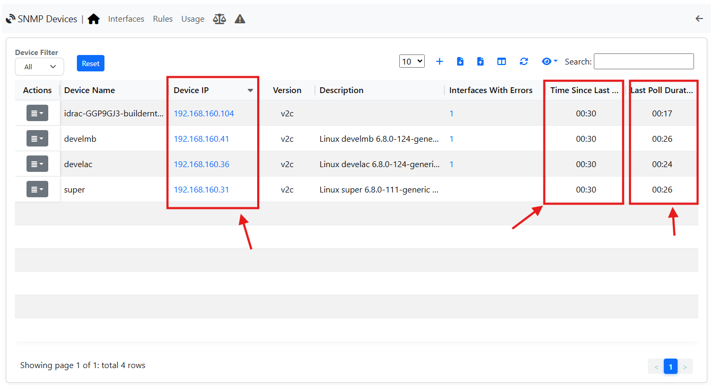
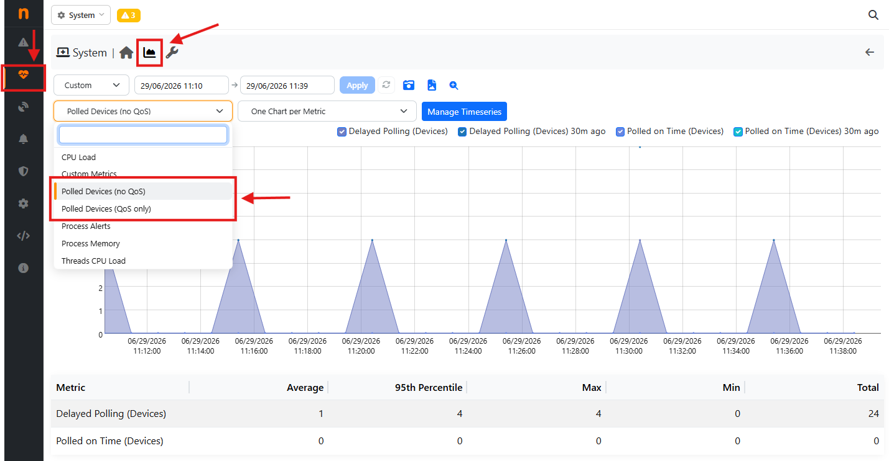

Statistics and Troubleshooting
------------------------------

ntopng periodically polls configured SNMP devices to collect interface,
system and performance statistics.

However there can be some trouble with the polled SNMP devices (delayed polling, no polling, ecc.).

There are some ways to identify these problems:

- By checking the SNMP page
- By checking the Statistics Timeseries 

Checking SNMP page
~~~~~~~~~~~~~~~~~~

By jumping to the SNMP Page, it is possible to identify issues in the Polling, by checking three factors:

- **Time Since Last Poll**: it is reported the last time the device was polled;
- **Last Poll Duration**: it is report the duration of the last poll;
- **Device IP**: here, in case the Device is not reachable, an icon will pop up reporting the problem (it should be visible from the **Time Since Last Poll**, also reporting some issue)

Checking Statistics Timeseries
~~~~~~~~~~~~~~~~~~~~~~~~~~~~~~

ntopng provides also additional timeseries that tracks whether devices are being polled 
according to the configured polling interval or not.

To access those charts, jump to the System Interface, Health page and then click on the Timeseries icon;

The chart reports two values over time:

- **Polled on Time**: number of devices successfully polled within the
  configured polling interval.
- **Delayed Polling**: number of devices whose polling operation was
  delayed beyond the expected interval.

This information allows administrators to immediately identify situations
where the polling engine is no longer able to keep up with the configured
schedule.

Typical Causes of Delayed Polling
~~~~~~~~~~~~~~~~~~~~~~~~~~~~~~~~~

A growing number of delayed devices usually indicates that the polling
engine is overloaded. Possible causes include:

- Too many SNMP devices configured
- Slow or high-latency network connections
- SNMP agents responding slowly
- Excessive CPU utilization on the ntopng host
- Disk or database I/O bottlenecks
